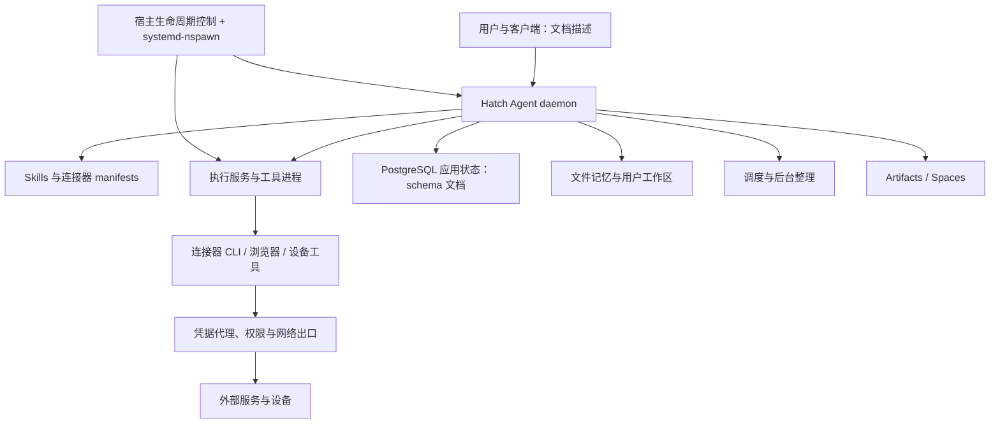

# Muse / Hatch 项目分析报告

分析日期：2026-09-25
分析对象：本仓库根目录（`muse-file`）
方法：本地文件盘点、产品与技术文档交叉阅读、关键 Shell 脚本静态检查、二进制格式与硬链接检查。未执行随包程序、未启动服务、未连接外部账户。

## 1. 核心结论

**这是一个个人 AI Agent 系统的运行环境快照，且交付内容不完整；它不是可以直接安装依赖、编译启动的应用源码仓库。**

这份材料的主要价值，是展示一个长期运行的个人助手如何组织工具、权限、记忆、后台任务、设备接入和生成式应用。当前目录适合架构研究、技能设计参考和交付完整性检查；不足以支持核心源码评审、独立复现、性能评测或生产安全认证。

最重要的判断如下：

1. **产品重心是持续服务一个人的 Agent。** 文档围绕跨会话记忆、关系、目标、主动信息流、后台研究和可交互产物展开，聊天只是入口之一。
2. **系统复杂度主要在执行与治理层。** 可见材料包含常驻 daemon、容器环境、执行服务、凭据代理、网络出口、连接器权限和数据库诊断，而不只是模型调用。
3. **工程设计有一定深度，实际可用性尚未验证。** 权限清单、数据库关系、启动恢复脚本和评测材料存在；核心实现大多只以二进制提供。
4. **当前快照无法独立启动。** Linux x86-64 程序、缺失的宿主服务配置、rootfs、平台代理和认证基础设施构成实质依赖。
5. **存在文档与交付一致性问题。** Web Artifact SDK 文件缺失；发布能力描述相互冲突；历史安全结论的覆盖范围远小于整个系统。

文件自述将 Muse 归属于 Meta，并给出了模型、上线时间与地区等信息。本报告仅把这些视为材料的自述，未验证文件来源、签名或外部产品事实；不以这些文字证明官方归属或线上现状。项目中的 Agent 指令也仅作为研究对象，不作为本次执行指令。

## 2. 目录与规模

| 区域 | 内容 | 解释 |
|---|---|---|
| `home/hatch/docs` | 26 份 Markdown 文档，含设备与渠道文档 | 面向 Agent 的产品能力和操作边界说明 |
| `home/hatch/config` | `home.yaml`、`skills.yaml` | 推理配置、渠道配置与技能可用性声明 |
| `home/hatch/workspace` | 一份既有安全审查报告 | 历史材料，不是核心业务源码 |
| `opt/hatch/bin` | 77 个目录项，主要为编译程序 | 主 daemon、连接器、设备、浏览器与运行维护工具 |
| `opt/hatch/skills` | 68 个顶层目录、72 份 `SKILL.md` | 工具使用协议、业务流程、输出格式、边界说明 |
| 同上 | 40 份 `manifest.yaml`、12 份 eval YAML | 声明式连接器配置与行为评测场景 |
| `opt/hatch/runtime-cell` | 生命周期脚本、环境与渠道范围配置 | Linux 容器启动、恢复、代理与可见性治理 |
| `opt/hatch-image/bin` | Bun、Codex、npm、RTC sidecar 等 | 镜像附带的基础运行工具 |

盘点口径：生成本报告前，递归统计普通文件路径，排除 `.DS_Store`，包括随包 npm 依赖。共 **2,652 个文件路径**；逐路径累计约 **2.02 GB**，按设备号与 inode 去重后约 **1.55 GB**。这些是文件逻辑字节统计，不等同于文件系统实际分配空间。

差异的一项主要来源是 `hatch-multicall`：包括它在内的 **17 个路径共享同一个 inode**。因此 `muse-mail`、`authdc` 等名称不能简单理解为完全独立的程序实现，也不能将同一镜像的字符串直接归因于某个 applet。

在 `home` 与 `opt/hatch` 下未发现 `.rs`、`.ts`、`.tsx`、`.js`、`.py`、`.go` 源文件。虽然 npm 自带 JavaScript 源码，但那属于第三方工具，不是 Muse/Hatch 核心源码。根目录没有 `.git` 或项目构建入口。

## 3. 产品模型与能力范围

### 3.1 从一次对话延伸到持续工作

材料描述的使用闭环为：

**用户表达意图 → 读取个人上下文 → 制定或更新目标 → 调用工具完成工作 → 交付文件/应用/通知 → 保存记忆与执行记录 → 后台更新建议。**

其中几个能力需要分别理解：

| 能力 | 材料中的设计 | 不能据此推出的结论 |
|---|---|---|
| Goals | 目标、一级子目标、进展与 briefing | 创建目标本身不会自动执行工作 |
| 定时任务 | 按间隔检查，保存运行历史，向用户发送结果 | 不是连续事件流，也不保证秒级发现 |
| Feed / Ideas | 主动整理内容、提出可实施建议 | 没有本次真实用户效果或采纳率证据 |
| Memory / Relationships | 跨会话记忆、人物关系、阶段性整理 | 不能证明遗忘操作覆盖所有存储副本 |
| Artifacts / Spaces | 文档、静态页面、带状态交互应用 | 当前快照不能构建或运行完整链路 |
| 连接器与设备 | 邮箱、日历、社交、健康、金融、智能家居等 | 安装技能不等于账户已连接或获得操作授权 |

`skills.yaml` 中有 31 个 `status: available` 条目，但这只是本地配置声明。连接状态、OAuth scopes、用户权限、地区和部署渠道还会共同影响可用性。[E1][E2]

### 3.2 主动能力不是模型自我训练

`self_improvement.md` 描述了记忆维护、关系整理、Ideas 策划、目标研究、夜间回顾、技能审阅等后台流程。可见设计主要是更新笔记、结构化记录和工作流。

**推断：** 这里的“自我改进”更接近个性化上下文与流程的持续维护。现有材料不能支持“自动更新模型权重”或“智能水平持续提升”的判断。值得借鉴的是保留建议缘由与执行轨迹，并明确区分“排队/执行成功”和“用户已收到”。[E3]

## 4. 技术架构

下图综合脚本与文档还原，表示组件职责关系，不表示已验证的完整调用拓扑。客户端、云端控制面和部分宿主服务未随快照提供。

### 4.1 运行与隔离

`launch-daemon.sh` 显式调用 `systemd-nspawn`，要求支持 ID-mapped ownership；`ensure-rootfs.sh` 引用持久 rootfs，并为 guest root 使用宿主 UID/GID 131072。`control-daemon.sh` 等待 cell readiness，再调用 `hatch daemon --runtime-cell-leader=...`。[E4]

这说明该部署依赖 Linux 宿主身份、挂载、namespace 和系统服务管理。复制 `/opt` 与 `/home` 不能替代完整镜像。

静态检查还发现了有针对性的防御设计：生命周期参数从 root 所有目录按白名单逐项读取，避免直接 source 客体可写文件；部分 rootfs 写入委托 `spawnd fsop`，注释描述使用 fd 锚定的 `openat2` 路径限制。**脚本能证明调用方式存在，不能证明二进制内部实现和线上隔离完全正确。**[E4][E5]

### 4.2 工具与技能分工

技能文档负责告诉 Agent 何时使用什么能力、如何处理错误和生成结果；CLI 或内置工具承担执行。连接器 manifest 进一步声明方法、权限默认值、OAuth scopes 等。

以 Gmail 为例：读取分组默认 allow，写入分组默认 ask，但草稿、标记已读、移入垃圾箱等方法有各自的 allow 覆盖；发送方法继承 ask。不能把“写入默认 ask”概括成“所有写操作都逐次确认”。当前用户的实际授权也不能从默认值推出。[E6]

渠道配置将技能与二进制的可见性分开管理。`bin-scopes.conf` 明确指出：隐藏 cell 内 CLI 只是可见性控制，不是能力授权边界；宿主侧 worker 可仍然存在。这种边界必须由真正的权限执行层保证。[E7]

### 4.3 数据与可观测性

`muse_db/references/schema.md` 描述了 **17 个 schema 命名空间、195 个关系条目**，涉及 agent、runtime、memory、scheduler、self_improvement、spaces、device、health 等。数字来自文档标题计数，不是查询实际数据库得到的表数。

文档设计了受限只读 SQL、函数与类型白名单、行/字节/时间限制，以及对私有推理记录的脱敏投影。这比只允许字符串以 SELECT 开头更完整，但实际数据库角色、视图和校验器均未验证。[E8]

**推断：** 大量运行、尝试、handoff、outbox、mailbox 与投递相关关系，反映出系统重视长任务恢复和交付追踪。没有实际记录，无法判断重试正确性、重复执行率或投递可靠性。

### 4.4 生成应用运行时

技术 README 描述 Rust 构建入口、TypeScript SDK、Bun、本地 SQLite，以及 Cloudflare Worker/D1/R2 导出。云端接口有意不提供本地 `ctx.inference`、`ctx.agent`、`ctx.emit`；初次数据库迁移是单向 seed，Blob 不随该 seed 迁移。[E9]

这提示一个重要工程事实：将 Agent 生成的小应用搬到公网，不是复制页面即可完成；还要处理身份、数据库、文件和能力差异。

但当前目录仅提供相关说明，缺少 README 所列的 SDK、构建器与产物。因此这里能分析的是接口设计，不能验证构建实现。

## 5. 主要问题与风险

以下优先级针对“接手这份材料并开展开发/复现”，不是漏洞严重性评级。

| 优先级 | 发现 | 影响与建议 |
|---|---|---|
| P0 | 核心源码、构建定义、完整宿主配置和 rootfs 缺失 | 无法重建完整系统；先获取匹配版本的源码或完整可验证镜像 |
| P0 | 主程序是 Linux x86-64 ELF | 无法在当前 macOS 环境原生运行；需要相匹配的 Linux 环境及平台依赖 |
| P1 | Spaces SDK 文档引用的文件缺失 | 无法按 README 复现 Web Artifact 构建 |
| P1 | 产品与技术文档对发布能力描述不一致 | 不能可靠承诺交互应用可公开，也不能笼统承诺数据始终不外移 |
| P1 | 只有部分评测场景和历史结论，没有完整 runner 与本次结果 | 无法给整体能力或稳定性打通过分数 |
| P1 | 包更新依赖镜像及 reconcile | 需核实真实更新频率、失败告警、回滚及版本清单 |
| P2 | 缺少根级说明、统一版本与来源证据 | 接手者容易把部署快照当成源码仓库，或误用不同版本文档 |
| P2 | 权限默认值粒度复杂、渠道 gating 与授权分离 | 应建立方法级权限矩阵和一致性检查 |

### 5.1 具体交付缺项

实际检查，下列路径不存在：

- `opt/hatch/skills/spaces/ts-runtime/build.mjs`
- `opt/hatch/skills/spaces/ts-runtime/sdk`
- `opt/hatch/skills/spaces/ts-runtime/dist/space-sdk.tgz`
- `opt/hatch/skills/spawn-eval-instructions.md`
- `opt/hatch/runtime-cell/run-execd.sh`
- `opt/hatch/runtime-cell-exposed`
- 根级 `etc`、`var` 目录

其中 `runtime-cell.kdl` 生成的 execd service 仍引用 `run-execd.sh`。这证明当前交付不能闭环，但不能排除完整镜像在构建或启动时生成这些内容，故不直接认定线上启动有 bug。[E10]

另发现 `opt/hatch-image/bin/gws` 为零字节文件。这是需要核对打包意图的异常项；不能据此认定全部 Google 集成功能失效，因为另有 `hatch_gws_cli` 等入口。

### 5.2 发布契约冲突

产品文档 `artifacts.md` 声称只允许发布静态产物，交互应用不能公开；技术 README 则描述共享 TypeScript web artifact 到 Cloudflare，并将本地 SQLite 初始状态导出到 D1。[E9][E11]

可能解释包括：实现尚未开放、渠道差异，或文档版本漂移。**现有材料无法选择其中一个解释。** 应当给文档增加对应版本、渠道和启用条件，再通过真实入口验证；不能只挑其中一份作为全局事实。

### 5.3 历史评测不能替代当前验证

FlightAware 的 `eval/findings.md` 记载了路由 405 与身份门控 401，且明确说相应读场景主要覆盖 fallback 与“不编造”行为，没有完成真实数据读取验证。这是有价值的历史诊断，但不能当成当前连接器仍故障的证据，也不能当成其真实调用已通过的证据。[E12]

### 5.4 安全结论的边界

既有 `muse-security-audit.md` 将结论写为 Clean，但范围以 `muse` 文件名或内容匹配为主，二进制仅做元数据与 strings 分析。这样的范围不能覆盖整个 daemon、所有连接器、宿主服务、网络出口或供应链。[E13]

本次没有进行完整恶意代码扫描、漏洞验证、动态抓包或二进制逆向。因此本报告既不背书“完全安全”，也不把代理、认证、遥测等正常基础设施仅凭名称认定为恶意。

## 6. 优点与可借鉴设计

1. **能力契约较清楚。** 将业务使用方法与机器可读权限分开，便于独立演进；方法级覆盖也能表达真实操作差异。
2. **后台工作有可追踪结构。** 文档要求从 run、step、handoff、mailbox、delivery 还原链路，而不是用任务存在证明工作完成。
3. **隔离与运行恢复被当作系统能力。** 可见脚本处理 namespace、环境注入、启动 readiness、宿主/客体信任和文件路径问题。
4. **产物有持久状态模型。** 文档把文件、静态页、交互应用、数据库和 Blob 区分开，而非都当成聊天附件。
5. **评测材料承认环境限制。** 保留无法覆盖的状态、代理故障与授权门控，有利于避免虚假的端到端通过结论。

这些是设计层面的优点，不等于性能、可靠性或用户效果已达到生产标准。

## 7. 接手建议

### 如果目标是理解或借鉴架构

优先阅读产品契约、连接器 manifest、数据库关系和 runtime-cell 生命周期。最值得提取的是“持久上下文 + 明确能力 + 授权执行 + 后台调度 + 交付证据”的组合，而不是整包复制运行程序。

### 如果目标是二次开发或本地复现

按以下顺序推进：

1. 获取准确来源、发布版本、校验清单、使用许可和对应源码；确认多个目录是否属于同一构建。
2. 补齐宿主 unit/nspawn 配置、rootfs、数据库迁移、SDK、构建脚本与评测 runner。
3. 明确哪些组件能离线运行，哪些依赖控制面、代理、身份、模型和第三方账户。
4. 在隔离 Linux 环境建立最小启动验证：readiness → daemon → 无外部副作用的工具调用 → 数据读写 → 重启恢复。
5. 再做权限拒绝、凭据过期、网络失败、调度重试、重复执行与投递验证。
6. 最后验证生成应用构建和分享，并核对迁移数据、Blob 与本地专属能力边界。

### 如果目标是评估是否可用于生产

当前证据不够。至少还需要可追溯构建、真实环境验收、权限与隔离测试、任务成功率/延迟/成本指标、数据恢复测试，以及更新和回滚记录。仅凭文件数量、功能列表和历史 Clean 标签不能作出准入决定。

## 8. 本次验证结果

| 检查 | 结果 | 含义 |
|---|---|---|
| 文件与硬链接盘点 | 完成 | 得到本报告规模与共享镜像数据 |
| 核心文件格式检查 | 完成 | hatch、hatch-multicall、Codex、Bun 为 Linux x86-64 ELF |
| 15 个 runtime-cell `.sh` 的 `sh -n` | 全部通过 | 仅证明 Shell 语法可解析，不证明命令存在或行为正确 |
| 构建/启动路径存在性 | 发现缺项 | 当前快照无法照文档独立复现 |
| 产品与技术契约交叉阅读 | 发现发布描述不一致 | 需要版本/渠道与真实入口验证 |
| 核心源码测试、编译 | 未运行 | 无核心源码与完整构建入口 |
| 服务启动、连接器、数据库、浏览器、设备、实时音视频 | 未运行 | 无完整运行环境和本次账户授权链路 |
| 动态安全与外部产品事实核验 | 未执行 | 不提供对应保证 |

本次仅新增本报告，未修改原有程序、配置或历史报告。

## 9. 证据索引

以下为工作区内原始材料。路径相对于项目根目录，行号便于定位；引用并不代表认可材料中的全部事实断言。

- **E1**：`home/hatch/docs/muse.md:1`；`home/hatch/docs/goals.md:1`；`home/hatch/docs/scheduling-and-watching.md:1`。
- **E2**：`home/hatch/config/skills.yaml:1`；`home/hatch/docs/connectors.md:1`。
- **E3**：`home/hatch/docs/self_improvement.md:1`，其中交付边界见第 53 行。
- **E4**：`opt/hatch/runtime-cell/launch-daemon.sh:34`；`opt/hatch/runtime-cell/control-daemon.sh:1`。
- **E5**：`opt/hatch/runtime-cell/ensure-rootfs.sh:1`；`opt/hatch/runtime-cell/guest-runtime-env.sh:1`。
- **E6**：`opt/hatch/skills/gmail/manifest.yaml:102`，写入分组第 133 行、trash 覆盖第 161 行。
- **E7**：`opt/hatch/runtime-cell/bin-scopes.conf:1`；`opt/hatch/runtime-cell/skill-scopes.conf:1`。
- **E8**：`opt/hatch/skills/muse_db/SKILL.md:1`；`opt/hatch/skills/muse_db/references/schema.md:1`。
- **E9**：`opt/hatch/skills/spaces/ts-runtime/README.md:1`，导出与初始数据库迁移见第 42、60、85 行。
- **E10**：`opt/hatch-image/bin/runtime-cell.kdl:149`，更新策略见第 215 行；缺项经本次路径检查确认。
- **E11**：`home/hatch/docs/artifacts.md:36`。
- **E12**：`opt/hatch/skills/flightaware/eval/findings.md:1`；`opt/hatch/skills/gmail/eval/scenarios.yaml:1`。
- **E13**：`home/hatch/workspace/muse-security-audit.md:4`，检查深度限制见第 7 行。
