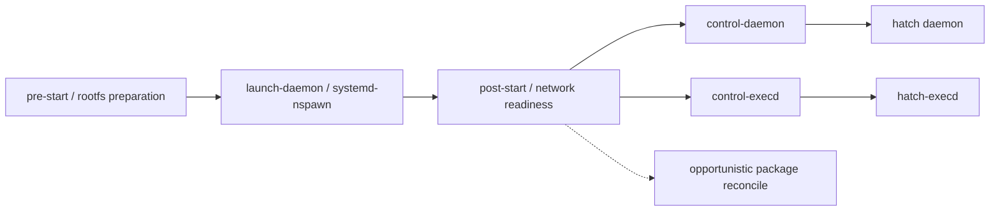

# MuseAI-Skills

Muse / Hatch skill documentation and runtime snapshot.

[简体中文](README.md) · [Technical analysis (Chinese)](PROJECT_ANALYSIS.md) · [File checksums](SHA256SUMS)

**Navigate:** [Skills](#skills) · [Files](#files) · [Architecture](#architecture) · [Download](#download)

This repository archives **a partial filesystem snapshot of a Muse / Hatch personal AI agent environment**. It contains product documentation, skill definitions, connector permission manifests, Linux runtime scripts, and bundled executables and dependencies for inspection and technical analysis.

**This is neither a complete source repository nor a one-command deployment package.** Most core programs are Linux x86-64 ELF binaries. Their source code, complete host configuration, root filesystem, and some runtime resources are absent. The supplied materials use the names Muse, Hatch, and Jarvis; this archive does not represent an official release or endorsement, and its provenance and product claims have not been independently verified.

<a id="skills"></a>

## Skills: the main reading collection

The skill texts are a particularly useful part of this snapshot for studying agent workflow design: they describe **when to trigger, how to route tasks, which tools to use, how to handle authorization and failure, and how to verify deliverables**. They can be inspected without downloading the large executables.

There are **72 `SKILL.md` paths: 68 distinct skill files plus 4 symlink aliases**. The tables below cover all 68 distinct files; the aliases are listed separately. Names are directory paths, which can differ from frontmatter names. “Bundled skills” describes their location in the snapshot, not independently authenticated official provenance or a verified open-source release.

### Suggested reading path

These selections emphasize workflow design that is useful to examine, not proven execution quality or drop-in compatibility.

| Skill | What to study |
|---|---|
| [wide-research](opt/hatch/skills/wide-research/SKILL.md) | Coordinator/worker boundaries, consistent output contracts, and failure coverage. |
| [skill-creator](opt/hatch/skills/skill-creator/SKILL.md) | Clear triggers, concise operational files, and on-demand references. |
| [artifacts/testing](opt/hatch/skills/artifacts/testing/SKILL.md) | Separate successful generation from usable, visually verified deliverables. |
| [goals](opt/hatch/skills/goals/SKILL.md) | Separate initial goal intake from ongoing support by life domain. |
| [forget](opt/hatch/skills/forget/SKILL.md) | Account for copies, derived state, and background work that can recreate information. |
| [travel-planning](opt/hatch/skills/travel-planning/SKILL.md) | Route itinerary research separately from live availability and transactions. |
| [magic-moment](opt/hatch/skills/magic-moment/SKILL.md) | Organize facts, narrative, visuals, timelines, and pre-render review. |
| [gmail](opt/hatch/skills/gmail/SKILL.md) | Read instructions together with method-level permissions and evaluation scenarios. |

### Agent workflows and memory（6）

| Skill | Documented purpose | Supporting files |
|---|---|---|
| [wide-research](opt/hatch/skills/wide-research/SKILL.md) | Research many independent inputs with a shared output schema, coverage counts, and failure reporting. | — |
| [goals](opt/hatch/skills/goals/SKILL.md) | Create goals by life domain, record commitments, and follow progress. | [Creation](opt/hatch/skills/goals/creation) · [Guides](opt/hatch/skills/goals/guides) |
| [skill-creator](opt/hatch/skills/skill-creator/SKILL.md) | Author skill triggers, resource layout, tooling/auth sections, and validation checks. | [References](opt/hatch/skills/skill-creator/references) |
| [self-awareness](opt/hatch/skills/self-awareness/SKILL.md) | Ground answers about agent capabilities, memory, and past work in observed state. | [References](opt/hatch/skills/self-awareness/references) |
| [forget](opt/hatch/skills/forget/SKILL.md) | Plan, confirm, and verify forgetting across memory and derived content. | [References](opt/hatch/skills/forget/references) |
| [muse_db](opt/hatch/skills/muse_db/SKILL.md) | Use bounded read-only database queries to trace execution and delivery records. | [References](opt/hatch/skills/muse_db/references) |

### Documents, spreadsheets, and artifact verification（6）

| Skill | Documented purpose | Supporting files |
|---|---|---|
| [artifacts/document](opt/hatch/skills/artifacts/document/SKILL.md) | Create and edit Word documents/templates, OOXML, tracked changes, and rendered output. | [References](opt/hatch/skills/artifacts/document/references) |
| [artifacts/markdown](opt/hatch/skills/artifacts/markdown/SKILL.md) | Produce Markdown files, READMEs, notes, and read-back verification. | — |
| [artifacts/pdf](opt/hatch/skills/artifacts/pdf/SKILL.md) | Author and manipulate PDFs, fill forms, and validate page geometry. | [References](opt/hatch/skills/artifacts/pdf/references) |
| [artifacts/presentation](opt/hatch/skills/artifacts/presentation/SKILL.md) | Build slides from per-slide HTML, theme plans, assembly, and PPTX export. | [References](opt/hatch/skills/artifacts/presentation/references) |
| [artifacts/spreadsheet](opt/hatch/skills/artifacts/spreadsheet/SKILL.md) | Create and clean spreadsheets, recalculate formulas, and validate workbooks. | [References](opt/hatch/skills/artifacts/spreadsheet/references) |
| [artifacts/testing](opt/hatch/skills/artifacts/testing/SKILL.md) | Apply per-format checks, fresh rendering, visual inspection, and placeholder scans. | — |

### Travel, local discovery, and booking（7）

| Skill | Documented purpose | Supporting files |
|---|---|---|
| [travel-planning](opt/hatch/skills/travel-planning/SKILL.md) | Plan itineraries, feasibility, entry/transit requirements, and ground logistics. | [Eval](opt/hatch/skills/travel-planning/eval) · [References](opt/hatch/skills/travel-planning/references) |
| [booking](opt/hatch/skills/booking/SKILL.md) | Route live availability and transactions for flights, hotels, restaurants, and tickets. | [Eval](opt/hatch/skills/booking/eval) · [References](opt/hatch/skills/booking/references) |
| [places-search](opt/hatch/skills/places-search/SKILL.md) | Find and compare venues, attractions, and local services by location. | [Eval](opt/hatch/skills/places-search/eval) |
| [duffel](opt/hatch/skills/duffel/SKILL.md) | Search, book, pay for, and manage flights; monitor booked fares when requested. | [Manifest](opt/hatch/skills/duffel/manifest.yaml) · [Eval](opt/hatch/skills/duffel/eval) |
| [flightaware](opt/hatch/skills/flightaware/SKILL.md) | Verify dated flight schedules, delays, cancellations, and operational changes. | [Manifest](opt/hatch/skills/flightaware/manifest.yaml) · [Eval](opt/hatch/skills/flightaware/eval) |
| [opentable](opt/hatch/skills/opentable/SKILL.md) | Find restaurant availability and create, change, or cancel reservations. | [Manifest](opt/hatch/skills/opentable/manifest.yaml) · [Eval](opt/hatch/skills/opentable/eval) |
| [ticketmaster](opt/hatch/skills/ticketmaster/SKILL.md) | Search events, seats, and prices; return checkout links without completing purchases. | [Manifest](opt/hatch/skills/ticketmaster/manifest.yaml) |

### Productivity, email, and knowledge tools（16）

| Skill | Documented purpose | Supporting files |
|---|---|---|
| [gmail](opt/hatch/skills/gmail/SKILL.md) | Search/read mail, draft/send/reply, manage labels, and unsubscribe. | [Manifest](opt/hatch/skills/gmail/manifest.yaml) · [Eval](opt/hatch/skills/gmail/eval) |
| [google-calendar](opt/hatch/skills/google-calendar/SKILL.md) | Inspect agendas and events and change schedules. | [Manifest](opt/hatch/skills/google-calendar/manifest.yaml) · [Eval](opt/hatch/skills/google-calendar/eval) |
| [google-contacts](opt/hatch/skills/google-contacts/SKILL.md) | Search, create, update, and delete contacts. | [Manifest](opt/hatch/skills/google-contacts/manifest.yaml) · [Eval](opt/hatch/skills/google-contacts/eval) |
| [google-docs](opt/hatch/skills/google-docs/SKILL.md) | Read, create, and edit Google Docs. | [Manifest](opt/hatch/skills/google-docs/manifest.yaml) |
| [google-drive](opt/hatch/skills/google-drive/SKILL.md) | Manage files/folders, uploads, downloads, and sharing. | [Manifest](opt/hatch/skills/google-drive/manifest.yaml) · [Eval](opt/hatch/skills/google-drive/eval) |
| [google-forms](opt/hatch/skills/google-forms/SKILL.md) | Read, create, and update forms and read responses. | [Manifest](opt/hatch/skills/google-forms/manifest.yaml) |
| [google-sheets](opt/hatch/skills/google-sheets/SKILL.md) | Read, write, and manage Google Sheets. | [Manifest](opt/hatch/skills/google-sheets/manifest.yaml) |
| [google-slides](opt/hatch/skills/google-slides/SKILL.md) | Read, create, and edit Google Slides. | [Manifest](opt/hatch/skills/google-slides/manifest.yaml) |
| [google-tasks](opt/hatch/skills/google-tasks/SKILL.md) | Manage task lists, create/update tasks, and mark completion. | [Manifest](opt/hatch/skills/google-tasks/manifest.yaml) · [Eval](opt/hatch/skills/google-tasks/eval) |
| [outlook-calendar](opt/hatch/skills/outlook-calendar/SKILL.md) | Read, create, update, and delete Outlook events. | [Manifest](opt/hatch/skills/outlook-calendar/manifest.yaml) |
| [outlook-contacts](opt/hatch/skills/outlook-contacts/SKILL.md) | Read, search, and manage Outlook contacts. | [Manifest](opt/hatch/skills/outlook-contacts/manifest.yaml) |
| [outlook-mail](opt/hatch/skills/outlook-mail/SKILL.md) | Read, search, send, reply to, and delete Outlook mail. | [Manifest](opt/hatch/skills/outlook-mail/manifest.yaml) |
| [notion](opt/hatch/skills/notion/SKILL.md) | Search, read, create, and update pages through Notion MCP. | [Manifest](opt/hatch/skills/notion/manifest.yaml) |
| [granola](opt/hatch/skills/granola/SKILL.md) | Search/read meeting notes and transcripts through an OAuth-backed MCP server. | [Manifest](opt/hatch/skills/granola/manifest.yaml) |
| [muse-mail](opt/hatch/skills/muse-mail/SKILL.md) | Operate Muse Mail mailboxes, forwarded messages, and intake workflows. | [References](opt/hatch/skills/muse-mail/references) |
| [calendly](opt/hatch/skills/calendly/SKILL.md) | Inspect Calendly events/event types and manage scheduling data. | [Manifest](opt/hatch/skills/calendly/manifest.yaml) |

### Social networks and messaging（6）

| Skill | Documented purpose | Supporting files |
|---|---|---|
| [facebook-cli](opt/hatch/skills/facebook-cli/SKILL.md) | Read Facebook content and social context; manage own Marketplace listings. | [Manifest](opt/hatch/skills/facebook-cli/manifest.yaml) · [References](opt/hatch/skills/facebook-cli/references) |
| [instagram](opt/hatch/skills/instagram/SKILL.md) | Read content, account information, and insights; publish posts/media on request. | [Manifest](opt/hatch/skills/instagram/manifest.yaml) · [References](opt/hatch/skills/instagram/references) |
| [instagram-messages](opt/hatch/skills/instagram-messages/SKILL.md) | Read inboxes/threads, search DMs, and send messages. | [Manifest](opt/hatch/skills/instagram-messages/manifest.yaml) |
| [messenger](opt/hatch/skills/messenger/SKILL.md) | Read contacts/calls/conversations and send, edit, unsend, or react to messages. | [Manifest](opt/hatch/skills/messenger/manifest.yaml) |
| [threads](opt/hatch/skills/threads/SKILL.md) | Inspect accounts, posts, feeds, and insights; search and publish on request. | [Manifest](opt/hatch/skills/threads/manifest.yaml) |
| [threads-messages](opt/hatch/skills/threads-messages/SKILL.md) | Read Threads inboxes and message threads and send messages. | [Manifest](opt/hatch/skills/threads-messages/manifest.yaml) |

### Shopping, merchandise, and financial data（3）

| Skill | Documented purpose | Supporting files |
|---|---|---|
| [shopping](opt/hatch/skills/shopping/SKILL.md) | Route product discovery, reverse-image shopping, comparisons, presentation, and purchases. | [References](opt/hatch/skills/shopping/references) |
| [printify](opt/hatch/skills/printify/SKILL.md) | Inspect catalogs and manage shops, products, and orders. | [Manifest](opt/hatch/skills/printify/manifest.yaml) |
| [plaid](opt/hatch/skills/plaid/SKILL.md) | Read connected accounts, balances, transactions, liabilities, and investments. | [Manifest](opt/hatch/skills/plaid/manifest.yaml) · [Eval](opt/hatch/skills/plaid/eval) |

### Health and fitness data（6）

| Skill | Documented purpose | Supporting files |
|---|---|---|
| [apple-healthkit](opt/hatch/skills/apple-healthkit/SKILL.md) | Read synced Apple Health metrics, sleep, and workout records. | [Manifest](opt/hatch/skills/apple-healthkit/manifest.yaml) |
| [google-health-connect](opt/hatch/skills/google-health-connect/SKILL.md) | Read synced Android health metrics, sleep, and workout records. | [Manifest](opt/hatch/skills/google-health-connect/manifest.yaml) |
| [function-health](opt/hatch/skills/function-health/SKILL.md) | Retrieve lab biomarker results and clinician notes. | [Manifest](opt/hatch/skills/function-health/manifest.yaml) |
| [healthex](opt/hatch/skills/healthex/SKILL.md) | Connect HealthEx and query medications, labs, and health records. | [Manifest](opt/hatch/skills/healthex/manifest.yaml) |
| [peloton](opt/hatch/skills/peloton/SKILL.md) | Browse fitness classes, schedules, and workout bookings. | [Manifest](opt/hatch/skills/peloton/manifest.yaml) |
| [withings](opt/hatch/skills/withings/SKILL.md) | Connect Withings and read body, activity, sleep, workout, and heart data. | [Manifest](opt/hatch/skills/withings/manifest.yaml) · [References](opt/hatch/skills/withings/references) |

### Image, audio, and video workflows（8）

| Skill | Documented purpose | Supporting files |
|---|---|---|
| [image-search](opt/hatch/skills/image-search/SKILL.md) | Search images and source pages by text query. | — |
| [media-library](opt/hatch/skills/media-library/SKILL.md) | Search and inspect the user photo library and connected device galleries. | — |
| [spotify](opt/hatch/skills/spotify/SKILL.md) | Discover music/podcasts and manage playlists and related content. | [Manifest](opt/hatch/skills/spotify/manifest.yaml) |
| [generate_podcast](opt/hatch/skills/generate_podcast/SKILL.md) | Compose single/multi-voice podcasts, briefings, or narrated summaries as MP3. | [References](opt/hatch/skills/generate_podcast/references) |
| [tts](opt/hatch/skills/tts/SKILL.md) | Convert supplied text to single- or multi-speaker speech. | [Manifest](opt/hatch/skills/tts/manifest.yaml) |
| [voice-design](opt/hatch/skills/voice-design/SKILL.md) | Choose or design a new speaking voice at the user request. | — |
| [voice-selector](opt/hatch/skills/voice-selector/SKILL.md) | Provide the static system voice catalog, not a standalone user workflow. | — |
| [magic-moment](opt/hatch/skills/magic-moment/SKILL.md) | Turn talking-head footage and real agent work into a synchronized vertical story. | [Guides](opt/hatch/skills/magic-moment/guide) · [Design refs](opt/hatch/skills/magic-moment/reference) |

### Devices, communications, and networking（6）

| Skill | Documented purpose | Supporting files |
|---|---|---|
| [device-data](opt/hatch/skills/device-data/SKILL.md) | Read cached contacts/calendars and remove Muse-local copies. | — |
| [wearable-device-skills](opt/hatch/skills/wearable-device-skills/SKILL.md) | Discover, inspect, and invoke capabilities exposed by paired phones/wearables. | — |
| [wearables-comms](opt/hatch/skills/wearables-comms/SKILL.md) | Handle wearable-originated calls/texts with contact and phone-number disambiguation. | — |
| [philips-hue](opt/hatch/skills/philips-hue/SKILL.md) | Control smart lights, rooms, scenes, and devices. | [Manifest](opt/hatch/skills/philips-hue/manifest.yaml) |
| [tessie](opt/hatch/skills/tessie/SKILL.md) | Inspect Tesla state and invoke explicit vehicle command endpoints. | [Manifest](opt/hatch/skills/tessie/manifest.yaml) |
| [tailscale](opt/hatch/skills/tailscale/SKILL.md) | Join Tailnet/Headscale, inspect connectivity, and access private machines through a TCP proxy. | — |

### Muse product operations（4）

| Skill | Documented purpose | Supporting files |
|---|---|---|
| [muse-early-access](opt/hatch/skills/muse-early-access/SKILL.md) | Submit, inspect, or withdraw early-access requests. | — |
| [muse-feedback](opt/hatch/skills/muse-feedback/SKILL.md) | Submit, inspect, or withdraw feedback and feature requests with user authorization. | — |
| [share-ideas](opt/hatch/skills/share-ideas/SKILL.md) | Publish reusable native Muse Ideas on explicit request. | — |
| [subscription-status](opt/hatch/skills/subscription-status/SKILL.md) | Inspect plans, quota, usage, reset times, and billing-related status. | — |

### Aliases and additional resources

| Alias | Actual target |
|---|---|
| [facebook](opt/hatch/skills/facebook/SKILL.md) | [facebook-cli](opt/hatch/skills/facebook-cli/SKILL.md) |
| [meta-threads](opt/hatch/skills/meta-threads/SKILL.md) | [threads](opt/hatch/skills/threads/SKILL.md) |
| [podcast](opt/hatch/skills/podcast/SKILL.md) | [generate_podcast](opt/hatch/skills/generate_podcast/SKILL.md) |
| [voice-calls](opt/hatch/skills/voice-calls/SKILL.md) | [voice-selector](opt/hatch/skills/voice-selector/SKILL.md) |

`voice-calls` points to a static voice catalog; its name does not establish an agent-operated calling capability. The [Spaces directory](opt/hatch/skills/spaces) includes runtime documentation and templates but has no top-level `SKILL.md`, so it is not counted as a separate skill here. The [shared Artifact references](opt/hatch/skills/artifacts/references) contain guidance for charts, maps, live data, Markdown, and related output. There are 40 manifest paths and 12 eval YAML files across the tree; these are resource counts, not extra skill counts or evidence of passing tests.

### Reading and adapting the skills

- Start with the skill's trigger, boundaries, and output contract; follow its local references and manifest where present.
- Workflow patterns can inform your own agent instructions. Adapt tool names, workspace paths, authorization rules, and validation steps to the target environment.
- Connector skills depend on the corresponding CLI/MCP, account connections, OAuth scopes, and runtime authorization. A copied Markdown file does not provide these capabilities.
- Some referenced helpers are absent: the Artifact validation scripts, the skill-creator connector scaffold helper, and Magic Moment's `mm` executable are not included. Spaces also lacks its SDK/build resources. The documentation is readable, but these execution pipelines are not complete.
- Keep source attribution and applicable licensing terms. “Available in this archive” does not mean “officially verified, independently runnable, or freely relicensable.”

To inspect all skills without downloading LFS binaries:

```bash
GIT_LFS_SKIP_SMUDGE=1 git clone https://github.com/win4r/MuseAI-Skills.git
cd MuseAI-Skills
```

Open `opt/hatch/skills/` or follow the links above. No bundled binary needs to be executed for this reading workflow.

## Start here

- For architecture, capability boundaries, missing components, and evidence references, read the [Chinese analysis report](PROJECT_ANALYSIS.md).
- For product design, start with the [overview](home/hatch/docs/muse.md), [goals](home/hatch/docs/goals.md), [scheduling](home/hatch/docs/scheduling-and-watching.md), and [background maintenance](home/hatch/docs/self_improvement.md).
- For tools and authorization, read the [connector guide](home/hatch/docs/connectors.md), [Gmail skill](opt/hatch/skills/gmail/SKILL.md), and its [permission manifest](opt/hatch/skills/gmail/manifest.yaml).
- For runtime architecture, inspect the [runtime-cell launcher](opt/hatch/runtime-cell/launch-daemon.sh), [daemon controller](opt/hatch/runtime-cell/control-daemon.sh), and [database schema guide](opt/hatch/skills/muse_db/references/schema.md).
- For generated applications, compare the [Artifacts guide](home/hatch/docs/artifacts.md) with the [TypeScript runtime README](opt/hatch/skills/spaces/ts-runtime/README.md). Their descriptions of publication capabilities differ.

<a id="files"></a>

## Repository layout and important files

The tree below expands the important paths; `…` omits additional executables and skills, and braces group sibling paths. The skill catalog above lists every skill entry. All links refer to files included in the published repository, not the separate local duplicate extraction directory.

```text
.
├── README.md / README.en.md
├── PROJECT_ANALYSIS.md
├── SHA256SUMS
├── .gitattributes / .gitignore
├── home/hatch/
│   ├── config/
│   │   ├── home.yaml
│   │   └── skills.yaml
│   ├── PROACTIVE_PREFERENCES.md
│   ├── assets/onboarding_tour/memory_import.md
│   ├── docs/
│   │   ├── muse.md / client-surfaces.md
│   │   ├── goals.md / feed.md / ideas.md / self_improvement.md
│   │   ├── scheduling-and-watching.md / connectors.md / browser.md
│   │   ├── artifacts.md / files-and-library.md
│   │   ├── privacy-and-credentials.md / data-handling.md
│   │   ├── payments-and-purchases.md / calls-texts-notifications.md
│   │   ├── voice.md / media.md / referrals.md / channel-availability.md
│   │   ├── channels/whatsapp.md
│   │   └── devices/
│   │       ├── mac_app.md / tailscale.md / home_link.md
│   │       └── home_link/integrations/
│   │           ├── brother_printers.md
│   │           ├── lutron_smart_bridges.md
│   │           └── shelly_plugs.md
│   └── workspace/muse-security-audit.md
└── opt/
    ├── hatch/
    │   ├── bin/
    │   │   ├── hatch / spawnd / hatch-execd / hatch-multicall
    │   │   └── …
    │   ├── runtime-cell/
    │   │   ├── pre-start.sh / launch-daemon.sh / post-start.sh
    │   │   ├── control-daemon.sh / control-execd.sh / run-daemon.sh
    │   │   ├── ensure-rootfs.sh / resolve-rootfs-path.sh
    │   │   ├── runtime-cell-entry.sh / require-modules.sh
    │   │   ├── guest.env / guest-runtime-env.sh
    │   │   ├── build-cell-trust-store.sh / hatch-preflight-opportunistic
    │   │   ├── skill-scopes.conf / bin-scopes.conf
    │   │   ├── stop.sh / post-stop.sh / is-loopback-rv.sh
    │   │   └── etc/{hosts,resolv.conf,wgetrc}
    │   └── skills/
    │       ├── gmail/{SKILL.md,manifest.yaml,eval/scenarios.yaml}
    │       ├── goals/{SKILL.md,creation/,guides/}
    │       ├── artifacts/{document,markdown,pdf,presentation,spreadsheet,testing}/
    │       ├── artifacts/references/
    │       ├── muse_db/{SKILL.md,references/schema.md}
    │       ├── magic-moment/{SKILL.md,INSTALL.md,guide/,reference/}
    │       ├── spaces/templates/{space-static,space-ts}/workspace_agents.md
    │       ├── spaces/ts-runtime/{README.md,docs/vertical-tool-schemas.md}
    │       └── …
    └── hatch-image/bin/
        ├── runtime-cell.kdl / hatch-manifest
        ├── convert-cell-intent / hatch-prewarm
        ├── bun / codex / codex-resources/bwrap
        ├── npm -> npm-package/bin/npm-cli.js
        ├── npx -> npm-package/bin/npx-cli.js
        ├── npm-package/{package.json,LICENSE,bin/,lib/,docs/,man/,node_modules/}
        ├── rtc-sidecar / rtc-sidecar-lib/
        └── disabled-user-mgmt / percona-telemetry-disabled / gws
```

### Reading paths correctly

The repository root is an archive root, not the root of a running operating system. `home/hatch/` represents the original agent home; `opt/hatch/` contains its bundle; `opt/hatch-image/` contains image-side tools. In the original documents, `~` normally means `/home/hatch`, not the home directory on your current laptop. Absolute `/run`, `/var/lib`, and `/etc` paths describe runtime dependencies and are mostly absent here. In particular, `opt/hatch/runtime-cell/etc/` contains three configuration templates; it is not a complete `/etc` tree.

### Repository root files

| File or directory | Purpose and reading notes |
|---|---|
| [README.md](README.md) / [README.en.md](README.en.md) | Bilingual entry points, skill catalog, file navigation, download instructions, and limitations. |
| [PROJECT_ANALYSIS.md](PROJECT_ANALYSIS.md) | Static analysis report: architecture findings, missing components, risks, validation scope, and evidence. |
| [SHA256SUMS](SHA256SUMS) | Content checksums for published regular files; excludes itself and symlinks and is not a provenance signature. |
| [.gitattributes](.gitattributes) | Preserves file bytes without text line-ending conversion; routes ELF programs and shared libraries through LFS. |
| [.gitignore](.gitignore) | Excludes macOS metadata; bundled npm dependencies are intentionally retained. |

### Agent configuration and workspace

| File or directory | Purpose and reading notes |
|---|---|
| [home/hatch/config/home.yaml](home/hatch/config/home.yaml) | Reasoning effort for root/subagents and a channel-provider configuration container; providers is empty in this snapshot, not a complete live capability inventory. |
| [home/hatch/config/skills.yaml](home/hatch/config/skills.yaml) | Declares 31 available skill entries; it is not an OAuth credential store, connection-state query, or permission-grant record. |
| [home/hatch/PROACTIVE_PREFERENCES.md](home/hatch/PROACTIVE_PREFERENCES.md) | Template for proactive topics, exclusions, timing, and presentation preferences; topic fields are empty here. |
| [home/hatch/assets/onboarding_tour/memory_import.md](home/hatch/assets/onboarding_tour/memory_import.md) | Prompt and user-review workflow for importing context from another AI; not an imported memory dataset. |
| [home/hatch/workspace/muse-security-audit.md](home/hatch/workspace/muse-security-audit.md) | Preserved historical review of the original environment; referenced paths are not necessarily included in this archive. |

### Product and device documentation

These 26 files document the product contract in the supplied snapshot. Account-specific statements and historical availability must not be read as verified current product behavior.

| File or directory | Purpose and reading notes |
|---|---|
| [muse.md](home/hatch/docs/muse.md) | Product overview and topic index. |
| [client-surfaces.md](home/hatch/docs/client-surfaces.md) | UI and capability differences across web, mobile, and Mac surfaces. |
| [goals.md](home/hatch/docs/goals.md) | Goals, subgoals, progress, briefings, and background-work boundaries. |
| [feed.md](home/hatch/docs/feed.md) | Feed content, generation behavior, and the user brief. |
| [ideas.md](home/hatch/docs/ideas.md) | Idea suggestion cards, execution, and dismissal behavior. |
| [self_improvement.md](home/hatch/docs/self_improvement.md) | Background memory, relationship, research, reflection, skill upkeep, and evidence tracing. |
| [scheduling-and-watching.md](home/hatch/docs/scheduling-and-watching.md) | Polling-based monitoring, scheduling limits, run history, and notification delivery. |
| [artifacts.md](home/hatch/docs/artifacts.md) | Storage, sharing, and deletion contracts for documents, pages, and interactive apps. |
| [files-and-library.md](home/hatch/docs/files-and-library.md) | Workspace files, Library behavior, downloads, and file presentation. |
| [connectors.md](home/hatch/docs/connectors.md) | Connection state, supported capabilities, method permissions, OAuth, and failure handling. |
| [browser.md](home/hatch/docs/browser.md) | Server-side browser sessions, interactive tasks, sign-in, and download limitations. |
| [privacy-and-credentials.md](home/hatch/docs/privacy-and-credentials.md) | Credential references, Vault, permissions, data export, and deletion rules. |
| [data-handling.md](home/hatch/docs/data-handling.md) | Documented data sources, use, user controls, and policy references within the supplied materials. |
| [payments-and-purchases.md](home/hatch/docs/payments-and-purchases.md) | Product comparison, checkout, transaction-term review, and wallet payment workflows. |
| [calls-texts-notifications.md](home/hatch/docs/calls-texts-notifications.md) | Entry points and boundaries for calls, texts, messages, and notifications. |
| [voice.md](home/hatch/docs/voice.md) | Voice availability described for this snapshot account, not all accounts. |
| [media.md](home/hatch/docs/media.md) | Documented image/video generation and editing capabilities. |
| [referrals.md](home/hatch/docs/referrals.md) | Invitations, referral codes, and redemption. |
| [channel-availability.md](home/hatch/docs/channel-availability.md) | Channel availability and delivery routing. |
| [channels/whatsapp.md](home/hatch/docs/channels/whatsapp.md) | WhatsApp channel setup and media guidance, not a connector implementation. |
| [devices/mac_app.md](home/hatch/docs/devices/mac_app.md) | Capability selection for a paired Mac and remote-agent/local-device boundaries. |
| [devices/tailscale.md](home/hatch/docs/devices/tailscale.md) | Private-network connection and access guidance. |
| [devices/home_link.md](home/hatch/docs/devices/home_link.md) | Home Link network bridge and device-discovery guidance. |
| [devices/home_link/integrations/brother_printers.md](home/hatch/docs/devices/home_link/integrations/brother_printers.md) | IPP discovery and printing workflow for Brother printers. |
| [devices/home_link/integrations/lutron_smart_bridges.md](home/hatch/docs/devices/home_link/integrations/lutron_smart_bridges.md) | HAP discovery and pairing for Lutron light/shade bridges. |
| [devices/home_link/integrations/shelly_plugs.md](home/hatch/docs/devices/home_link/integrations/shelly_plugs.md) | Shelly plug identification, switching, and power data. |

### Skill packages and supporting files

| File or directory | Purpose and reading notes |
|---|---|
| [SKILL.md（以 Gmail 为例 / Gmail example）](opt/hatch/skills/gmail/SKILL.md) | Skill entry point: frontmatter defines triggers; the body defines procedure and boundaries. |
| [manifest.yaml（Gmail）](opt/hatch/skills/gmail/manifest.yaml) | Machine-readable connector metadata, permission defaults, scope requirements, and command mappings; method-level rules can override group defaults. |
| [eval/scenarios.yaml（Gmail）](opt/hatch/skills/gmail/eval/scenarios.yaml) | Behavioral scenarios, user objectives, and expected behavior; definitions are not passing test results. |
| [opt/hatch/skills/flightaware/eval/findings.md](opt/hatch/skills/flightaware/eval/findings.md) | Historical evaluation findings and infrastructure blockers; interpret with their version and environment. |
| [opt/hatch/skills/skill-creator/references/authoring_guide.md](opt/hatch/skills/skill-creator/references/authoring_guide.md) | Naming, resource separation, templates, and review checks for skill authors. |
| [opt/hatch/skills/goals/creation](opt/hatch/skills/goals/creation) / [opt/hatch/skills/goals/guides](opt/hatch/skills/goals/guides) | The first contains domain-specific goal intake guides; the second contains scaffolds for ongoing support. |
| [opt/hatch/skills/muse_db/references/schema.md](opt/hatch/skills/muse_db/references/schema.md) | Restricted SQL rules, identifier index, and 195 relation descriptions across 17 schemas; not a database or migration source. |
| [opt/hatch/skills/forget/references/artifact-inventory.md](opt/hatch/skills/forget/references/artifact-inventory.md) | Cross-system data-location inventory for planning a forgetting operation. |
| [opt/hatch/skills/artifacts/references](opt/hatch/skills/artifacts/references) / [opt/hatch/skills/artifacts/testing/SKILL.md](opt/hatch/skills/artifacts/testing/SKILL.md) | Shared prose/chart/map guidance and cross-format validation rules; referenced helper scripts are incomplete. |
| [opt/hatch/skills/magic-moment/guide](opt/hatch/skills/magic-moment/guide) / [opt/hatch/skills/magic-moment/reference](opt/hatch/skills/magic-moment/reference) | Source footage, factual narrative, visuals, screenplay, timeline, and pre-render review guidance plus design specifications. |
| [opt/hatch/skills/magic-moment/reference/design-system/muse-moments-kit.html](opt/hatch/skills/magic-moment/reference/design-system/muse-moments-kit.html) / [opt/hatch/skills/magic-moment/reference/design-system/story-compositions.html](opt/hatch/skills/magic-moment/reference/design-system/story-compositions.html) | HTML component and composition references, not a full product frontend; some dependent assets may be absent. |
| [opt/hatch/skills/spaces/templates/space-static/workspace_agents.md](opt/hatch/skills/spaces/templates/space-static/workspace_agents.md) / [opt/hatch/skills/spaces/templates/space-ts/workspace_agents.md](opt/hatch/skills/spaces/templates/space-ts/workspace_agents.md) | Agent instruction templates for static and TypeScript artifact workspaces, not generated application source. |
| [opt/hatch/skills/spaces/ts-runtime/README.md](opt/hatch/skills/spaces/ts-runtime/README.md) / [opt/hatch/skills/spaces/ts-runtime/docs/vertical-tool-schemas.md](opt/hatch/skills/spaces/ts-runtime/docs/vertical-tool-schemas.md) | Application-runtime and vertical-tool data contracts; the described SDK and build files are missing. |
| [opt/hatch/skills/generate_podcast/references/save-to-spotify.md](opt/hatch/skills/generate_podcast/references/save-to-spotify.md) / [opt/hatch/skills/generate_podcast/save-to-spotify/manifest.yaml](opt/hatch/skills/generate_podcast/save-to-spotify/manifest.yaml) / [opt/hatch/skills/generate_podcast/save-to-spotify/vendor/save-to-spotify/README.md](opt/hatch/skills/generate_podcast/save-to-spotify/vendor/save-to-spotify/README.md) | Save-to-Spotify workflow, permissions, and upstream release-pinning notes; the vendor README is not complete upstream source. |

### Runtime lifecycle and configuration

These are implementation scripts/configurations, not a copy-and-run tutorial. The comments and visible calls establish their intended responsibilities; full host units and nspawn settings are missing.

| File or directory | Purpose and reading notes |
|---|---|
| [pre-start.sh](opt/hatch/runtime-cell/pre-start.sh) | Prepare mounts, egress gating, lifecycle records, and stale-state cleanup before startup. |
| [ensure-rootfs.sh](opt/hatch/runtime-cell/ensure-rootfs.sh) | Prepare/reconcile the image-local rootfs, paths, ownership, guest environment, and system configuration; delegates some file operations to spawnd. |
| [resolve-rootfs-path.sh](opt/hatch/runtime-cell/resolve-rootfs-path.sh) | Currently returns /var/lib/hatch-runtime/rootfs, an external runtime path rather than a directory in this repository. |
| [require-modules.sh](opt/hatch/runtime-cell/require-modules.sh) | Preload required kernel modules, block listed unnecessary modules, and write readiness markers. |
| [launch-daemon.sh](opt/hatch/runtime-cell/launch-daemon.sh) | Launch the systemd-nspawn container and assemble channel-scoped skill/binary overlays; despite its name it is not merely the agent executable launcher. |
| [post-start.sh](opt/hatch/runtime-cell/post-start.sh) | Configure veth addressing and network filtering and publish runtime readiness. |
| [runtime-cell-entry.sh](opt/hatch/runtime-cell/runtime-cell-entry.sh) | Shared host-controller functions for leader PID lookup, readiness waits, and environment loading. |
| [control-daemon.sh](opt/hatch/runtime-cell/control-daemon.sh) | Host-side environment/readiness/lifecycle handling before invoking hatch daemon. |
| [control-execd.sh](opt/hatch/runtime-cell/control-execd.sh) | Preserve systemd socket-activation state and invoke hatch-execd with the cell leader. |
| [run-daemon.sh](opt/hatch/runtime-cell/run-daemon.sh) | Bundled guest-side entry: load guest environment, drop PTRACE capability, and exec the daemon; presence alone does not establish its use by the current controller. |
| [guest.env](opt/hatch/runtime-cell/guest.env) | Plain KEY=VALUE configuration for HOME/PATH, proxies, sockets, and CA paths; distinct from a shell script. |
| [guest-runtime-env.sh](opt/hatch/runtime-cell/guest-runtime-env.sh) | Sourceable shell environment-export script with env/override loading logic. |
| [build-cell-trust-store.sh](opt/hatch/runtime-cell/build-cell-trust-store.sh) | Build host-owned trust anchors and NSS databases for read-only cell mounts. |
| [hatch-preflight-opportunistic](opt/hatch/runtime-cell/hatch-preflight-opportunistic) | Extensionless shell script for post-readiness package reconciliation; logs failures without blocking startup. |
| [skill-scopes.conf](opt/hatch/runtime-cell/skill-scopes.conf) | Channel-scoped visibility of additional skill directories; marked as generated from an upstream manifest. |
| [bin-scopes.conf](opt/hatch/runtime-cell/bin-scopes.conf) | Independently scopes extra CLI visibility by channel; visibility gating is not execution authorization. |
| [stop.sh](opt/hatch/runtime-cell/stop.sh) | Drain/stop orchestration, bounded waits, container shutdown, and database-state handling. |
| [post-stop.sh](opt/hatch/runtime-cell/post-stop.sh) | Clean readiness markers, home-mount propagation anchors, and residual veth state. |
| [is-loopback-rv.sh](opt/hatch/runtime-cell/is-loopback-rv.sh) | Classify whether /hatch uses a loopback substitute volume via exit codes; some caller comments differ from the current resolver implementation. |
| [etc/hosts](opt/hatch/runtime-cell/etc/hosts) | Static cell hostname and proxy-address mappings. |
| [etc/resolv.conf](opt/hatch/runtime-cell/etc/resolv.conf) | Cell DNS gateway configuration. |
| [etc/wgetrc](opt/hatch/runtime-cell/etc/wgetrc) | CA bundle path selected for Wget. |

The conceptual startup relationship is:



This is a responsibility map, not a verified systemd dependency graph. `runtime-cell-entry.sh` supplies shared readiness/environment helpers; `guest.env` supplies configuration. The post-ready reconcile can run alongside the daemon, so readiness does not prove every package update has finished.

### Core binaries and CLI groups

`opt/hatch/bin/` contains 77 executable paths. Key entries and groups follow; the table explicitly distinguishes script-backed roles from grouping based only on names. No binary was run to obtain these descriptions.

| File or directory | Purpose and reading notes |
|---|---|
| [hatch](opt/hatch/bin/hatch) | Main agent daemon, with invocation visible in control-daemon.sh. |
| [spawnd](opt/hatch/bin/spawnd) | Runtime management helper; scripts invoke file operations, mounts, network gates, and lifecycle events, not just process spawning. |
| [hatch-execd](opt/hatch/bin/hatch-execd) | Execution service with documented host entry and socket-activation handling. |
| [hatch-multicall](opt/hatch/bin/hatch-multicall) · [muse-mail](opt/hatch/bin/muse-mail) · [authdc](opt/hatch/bin/authdc) | Multiple invocation names for a shared executable image; the original snapshot has 17 hardlink paths, an inode relationship Git checkout does not preserve. |
| [hatch_gws_cli](opt/hatch/bin/hatch_gws_cli) · [hatch_gws_auth](opt/hatch/bin/hatch_gws_auth) · [hatch_messenger_cli](opt/hatch/bin/hatch_messenger_cli) | Google Workspace/Messenger-related programs; executable names can differ from skill directories, so consult the skill for invocation. |
| [browser-broker](opt/hatch/bin/browser-broker) · [browser-service](opt/hatch/bin/browser-service) · [hatch-browser-lease-helper](opt/hatch/bin/hatch-browser-lease-helper) · [ingress-rev-proxy](opt/hatch/bin/ingress-rev-proxy) | Browser coordination/service/lease and ingress-proxy components, grouped by name; internal protocols and runtime behavior are unverified. |
| [hatch-doctor](opt/hatch/bin/hatch-doctor) · [hatch-healthd](opt/hatch/bin/hatch-healthd) · [hatch-rescue](opt/hatch/bin/hatch-rescue) · [hatch-rescuectl](opt/hatch/bin/hatch-rescuectl) · [hatch-rescue-systemctl](opt/hatch/bin/hatch-rescue-systemctl) | Programs named for diagnostics, health, and recovery; source and standalone operating manuals are absent, so names do not establish supported flags. |
| [hatch-vault](opt/hatch/bin/hatch-vault) · [hatch-connector-output](opt/hatch/bin/hatch-connector-output) · [hatch-ws-client](opt/hatch/bin/hatch-ws-client) | Components named for vault access, connector output, and a WebSocket client; listed as files without validating internals. |
| [duffel](opt/hatch/bin/duffel) · [plaid](opt/hatch/bin/plaid) · [spotify-api](opt/hatch/bin/spotify-api) · [device-data](opt/hatch/bin/device-data) · [wearables-display](opt/hatch/bin/wearables-display) | Examples of connector/device CLIs; read with their skill, manifest, and account-authorization requirements. |

### Image-side tools and third-party dependencies

| File or directory | Purpose and reading notes |
|---|---|
| [runtime-cell.kdl](opt/hatch-image/bin/runtime-cell.kdl) | Package and configuration manifest including systemd unit content and version pins; not a complete rootfs or build project. |
| [hatch-manifest](opt/hatch-image/bin/hatch-manifest) | Binary invoked by reconciliation scripts to apply the runtime manifest. |
| [convert-cell-intent](opt/hatch-image/bin/convert-cell-intent) | Extensionless Python script that converts old-rootfs package state into an OS-intent ledger and can emit a base manifest. |
| [hatch-prewarm](opt/hatch-image/bin/hatch-prewarm) | Extensionless Bash script that prewarms selected program/dependency page-cache data within a budget. |
| [bun](opt/hatch-image/bin/bun) | Bundled Linux JavaScript/TypeScript runtime binary, not skill source. |
| [codex](opt/hatch-image/bin/codex) | Bundled Linux binary named codex; presence alone does not establish exact version, provenance, or the active model. |
| [codex-resources/bwrap](opt/hatch-image/bin/codex-resources/bwrap) | Bundled bwrap isolation helper; actual invocation policy is unverified. |
| [npm-package](opt/hatch-image/bin/npm-package) | npm 10.9.4 bundle with lib, bin, docs, man, node_modules, and licenses; third-party tool code rather than Muse core source. |
| [npm](opt/hatch-image/bin/npm) | Symlink to npm-package/bin/npm-cli.js; npx similarly points to npx-cli.js. |
| [rtc-sidecar](opt/hatch-image/bin/rtc-sidecar) | Sidecar binary named for real-time communication; its media integration is unverified. |
| [rtc-sidecar-lib](opt/hatch-image/bin/rtc-sidecar-lib) | Shared .so libraries shipped alongside the RTC sidecar. |
| [disabled-user-mgmt](opt/hatch-image/bin/disabled-user-mgmt) | Account-management rejection stub for the immutable image, directing provisioning to build time. |
| [percona-telemetry-disabled](opt/hatch-image/bin/percona-telemetry-disabled) | No-op success stub described as replacing the Percona telemetry entry point; does not establish that the whole system lacks telemetry. |
| [gws](opt/hatch-image/bin/gws) | Zero-byte file in this snapshot, not a usable Google CLI. |

### Connecting the files: a reading example

For Gmail, read the [skill](opt/hatch/skills/gmail/SKILL.md) for the workflow, the [manifest](opt/hatch/skills/gmail/manifest.yaml) for method permissions and scopes, and the [eval scenarios](opt/hatch/skills/gmail/eval/scenarios.yaml) for expected behavior. Then compare the shared [connector contract](home/hatch/docs/connectors.md). The compiled CLI alone cannot explain this policy. Likewise, `config/skills.yaml` declaring a skill available does not supply an account connection, while `skill-scopes.conf` controls visibility rather than granting permission.

Snapshot inventory, excluding `.DS_Store` and newly added repository documents and checksums:

| Item | Count |
|---|---:|
| Original snapshot file paths | 2,652 |
| Product and device documents | 26 |
| Top-level skill directories / `SKILL.md` files | 68 / 72 |
| `manifest.yaml` files | 40 |
| Evaluation YAML files | 12 |
| Entries in `opt/hatch/bin` | 77 |
| Documented database namespaces / relations | 17 / 195 |

Use the Git tree and `SHA256SUMS` for the exact published file set. Database counts describe the supplied documentation, not a live database query.

<a id="architecture"></a>

## Design overview

The materials describe an agent that receives user requests, consults personal context, works with goals and memory, invokes tools, delivers messages or artifacts, and maintains contextual knowledge and suggestions in background workflows.

| Layer | Visible materials |
|---|---|
| Product and personal context | Goals, Feed, Ideas, Memory, Relationships |
| Agent execution | Hatch daemon, execution service, connector CLIs, browser and device tools |
| Capability contracts | Skills and manifests with method-level permissions and OAuth scopes |
| Persistence and observability | PostgreSQL schema documentation and execution/delivery record designs |
| Runtime isolation | systemd-nspawn, host/guest lifecycle, proxy and trust configuration |
| Generated applications | Artifact, Spaces, TypeScript SDK, and database migration documentation |

The files provide evidence of design intent and parts of the implementation structure. They do not establish that a feature is currently operational, an account is connected, permissions are granted, or tests have passed.

<a id="download"></a>

## Download and verify

### Full checkout, including binaries

Install [Git LFS](https://git-lfs.com/) first:

```bash
git lfs install
git clone https://github.com/win4r/MuseAI-Skills.git
cd MuseAI-Skills
git lfs pull
git lfs fsck
```

Executables and shared libraries are tracked through Git LFS. Without LFS, or when downloads are skipped, those paths may contain small pointer files. Do not assume a standard ZIP download contains all LFS objects; prefer the commands above.

The original files total approximately 2.02 GB when counted by path, or 1.55 GB when deduplicated by local inode. Git does not preserve hardlink relationships, so multiple names for a shared executable will generally become separate files after checkout. Allow roughly 2 GB for the working tree plus additional Git/LFS cache space.

### Documentation-only checkout

```bash
GIT_LFS_SKIP_SMUDGE=1 git clone https://github.com/win4r/MuseAI-Skills.git
cd MuseAI-Skills
```

Run `git lfs pull` later if you need the binaries.

### Content checksums

After downloading LFS objects, run from the repository root:

```bash
# Linux
sha256sum --check SHA256SUMS

# macOS
shasum -a 256 --check SHA256SUMS
```

The manifest covers published regular files, excluding itself, `.git`, and ignored local metadata. Symlinks are tracked by Git and excluded from this regular-file manifest. Checksums establish content consistency, not provenance or executable safety.

## Runtime limitations and missing components

This snapshot cannot boot independently. The download instructions are not installation or deployment instructions.

- Core programs target **Linux x86-64**, not native macOS execution.
- Core source code and complete build definitions are missing.
- Complete host services, rootfs, database migrations, and control-plane dependencies are missing.
- The Web Artifact README references `build.mjs`, `sdk/`, and `dist/space-sdk.tgz`, none of which is included.
- The evaluation YAML files reference a missing `spawn-eval-instructions.md`.
- `runtime-cell.kdl` references a missing `run-execd.sh`; a complete image might generate it separately.
- `opt/hatch-image/bin/gws` is empty. This does not establish that other Google CLI entry points are broken.
- Product documentation limits publication to static artifacts, while technical documentation describes Cloudflare export with database state. The applicable versions and enabled channels are unconfirmed.

The bundled lifecycle scripts contain absolute paths, mounts, permission changes, and system service operations. They target their original Linux environment and are not generic workstation installers.

## Validation scope

The local analysis included inventory and hardlink checks, selected executable format inspection, documentation cross-checks, and `sh -n` checks of 15 runtime-cell shell scripts. All 15 passed syntax validation.

Service startup, core compilation, database connectivity, live connectors, paired devices, full application builds, and dynamic security testing were not performed. The historical [security review](home/hatch/workspace/muse-security-audit.md) is preserved with its original scope and wording; it is not a system-wide security endorsement.

## Copyright and licensing

This is a public archive. **Public availability does not establish a uniform open-source license for all included content.** No repository-wide MIT, Apache, or similar license has been assigned to this snapshot. Existing component copyrights, trademarks, and licenses remain applicable. Bundled npm and dependency license files are retained, including [npm's LICENSE](opt/hatch-image/bin/npm-package/LICENSE).

The snapshot does not include a verified redistribution license covering all Muse/Hatch content. This repository grants no additional rights on behalf of the original rights holders; applicable terms must be checked for each component and file.
