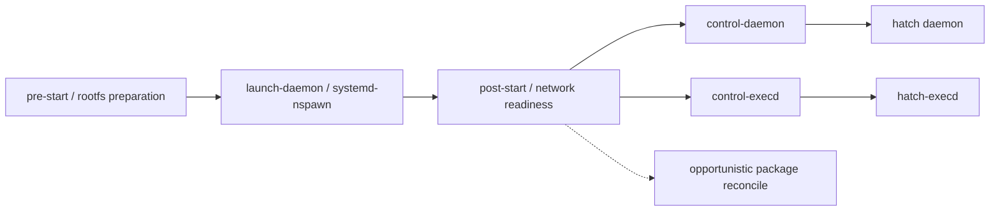

# Muse / Hatch Skills 与运行环境快照

[English](README.en.md) · [中文分析报告](PROJECT_ANALYSIS.md) · [文件校验清单](SHA256SUMS)

**快速导航：**[技能目录](#skills) · [文件结构与作用](#files) · [系统架构](#architecture) · [下载与校验](#download)

这份仓库存档了一个 **Muse / Hatch 个人 AI Agent 环境的部分文件**，包括产品说明、技能定义、连接器权限清单、Linux 运行环境脚本，以及随包程序和依赖，供结构阅读与技术分析。

**它不是完整源码仓库，也不是可以一键部署的安装包。** 核心程序主要以 Linux x86-64 ELF 二进制提供；构建源码、完整宿主配置、rootfs 和部分运行资源不在这份快照中。仓库附带的材料自述使用 Muse、Hatch、Jarvis 等名称；本存档不代表官方发布或认可，也未独立验证这些材料的来源与产品声明。

<a id="skills"></a>

## Skills：本仓库的重点阅读内容

对研究 Agent 工作流设计而言，随包技能文本是这份快照中尤其值得阅读的部分：它们具体描述了 **何时触发、如何分流任务、使用哪些工具、怎样处理授权与失败，以及如何验收交付物**。阅读这些内容不需要下载体积较大的二进制。

目录里共有 **72 个 `SKILL.md` 路径：68 个独立技能文件，加上 4 个符号链接别名**。下面的分类表完整覆盖 68 个独立文件，别名单独列出。名称使用目录路径，可能与 frontmatter 中的名称不同。这里称为“随包技能”，表示它们在快照中的位置；尚未独立认证其官方来源，也不将其称为已验证的官方开源发布。

### 建议优先阅读

以下按工作流设计的参考价值选择，不代表运行效果排名，也不代表可以直接安装使用。

| 技能 | 值得研究的设计 |
|---|---|
| [wide-research](opt/hatch/skills/wide-research/SKILL.md) | 如何限定协调者与 worker、统一输出契约，并报告失败覆盖。 |
| [skill-creator](opt/hatch/skills/skill-creator/SKILL.md) | 如何让触发条件明确、主文件精简、参考资料按需加载。 |
| [artifacts/testing](opt/hatch/skills/artifacts/testing/SKILL.md) | 如何将“生成成功”与“交付物可用”分开验收。 |
| [goals](opt/hatch/skills/goals/SKILL.md) | 如何按领域区分首次建目标与后续跟进，避免重复 intake。 |
| [forget](opt/hatch/skills/forget/SKILL.md) | 如何处理副本、衍生状态与可能重新写回信息的后台任务。 |
| [travel-planning](opt/hatch/skills/travel-planning/SKILL.md) | 如何把行程研究与实时可订查询、交易分开路由。 |
| [magic-moment](opt/hatch/skills/magic-moment/SKILL.md) | 如何从事实素材、叙事、视觉到时间线与渲染前审阅组织流水线。 |
| [gmail](opt/hatch/skills/gmail/SKILL.md) | 如何结合技能正文、方法级权限 manifest 与行为评测场景阅读。 |

### Agent 工作流与记忆（6）

| 技能 | 文档描述的用途 | 配套资料 |
|---|---|---|
| [wide-research](opt/hatch/skills/wide-research/SKILL.md) | 多输入并行研究；统一输出字段、覆盖率与失败项。 | — |
| [goals](opt/hatch/skills/goals/SKILL.md) | 分生活领域创建目标、记录承诺并持续跟进进展。 | [创建指南](opt/hatch/skills/goals/creation) · [跟进指南](opt/hatch/skills/goals/guides) |
| [skill-creator](opt/hatch/skills/skill-creator/SKILL.md) | 技能触发描述、目录拆分、工具/认证说明和编写检查。 | [参考](opt/hatch/skills/skill-creator/references) |
| [self-awareness](opt/hatch/skills/self-awareness/SKILL.md) | 根据实际文件和状态回答 Agent 能力、记忆与已完成工作。 | [参考](opt/hatch/skills/self-awareness/references) |
| [forget](opt/hatch/skills/forget/SKILL.md) | 规划、确认与验证跨记忆及衍生内容的遗忘流程。 | [参考](opt/hatch/skills/forget/references) |
| [muse_db](opt/hatch/skills/muse_db/SKILL.md) | 受限只读查询与跨表追踪，诊断执行和交付记录。 | [参考](opt/hatch/skills/muse_db/references) |

### 文档、表格与产物验收（6）

| 技能 | 文档描述的用途 | 配套资料 |
|---|---|---|
| [artifacts/document](opt/hatch/skills/artifacts/document/SKILL.md) | Word 文档、模板、OOXML 编辑、修订与渲染验证。 | [参考](opt/hatch/skills/artifacts/document/references) |
| [artifacts/markdown](opt/hatch/skills/artifacts/markdown/SKILL.md) | Markdown 文档、README、纪要与交付前回读。 | — |
| [artifacts/pdf](opt/hatch/skills/artifacts/pdf/SKILL.md) | PDF 编排、现有文件处理、表单填写与几何校验。 | [参考](opt/hatch/skills/artifacts/pdf/references) |
| [artifacts/presentation](opt/hatch/skills/artifacts/presentation/SKILL.md) | 逐页 HTML、主题规划、幻灯片组装与 PPTX 导出。 | [参考](opt/hatch/skills/artifacts/presentation/references) |
| [artifacts/spreadsheet](opt/hatch/skills/artifacts/spreadsheet/SKILL.md) | 表格创建、清洗、公式重算与工作簿验证。 | [参考](opt/hatch/skills/artifacts/spreadsheet/references) |
| [artifacts/testing](opt/hatch/skills/artifacts/testing/SKILL.md) | 按产物类型检查、重新渲染、目视验收与占位符扫描。 | — |

### 旅行、本地搜索与预订（7）

| 技能 | 文档描述的用途 | 配套资料 |
|---|---|---|
| [travel-planning](opt/hatch/skills/travel-planning/SKILL.md) | 行程规划、可行性、入境/转机与交通衔接。 | [评测场景](opt/hatch/skills/travel-planning/eval) · [参考](opt/hatch/skills/travel-planning/references) |
| [booking](opt/hatch/skills/booking/SKILL.md) | 航班、酒店、餐厅及门票的实时可订选项与交易入口。 | [评测场景](opt/hatch/skills/booking/eval) · [参考](opt/hatch/skills/booking/references) |
| [places-search](opt/hatch/skills/places-search/SKILL.md) | 按地点寻找和比较餐厅、咖啡馆、景点及本地服务。 | [评测场景](opt/hatch/skills/places-search/eval) |
| [duffel](opt/hatch/skills/duffel/SKILL.md) | 航班搜索、预订、付款、订单管理及明确请求的票价监测。 | [权限清单](opt/hatch/skills/duffel/manifest.yaml) · [评测场景](opt/hatch/skills/duffel/eval) |
| [flightaware](opt/hatch/skills/flightaware/SKILL.md) | 核实具体日期的航班时刻、延误、取消与运行变化。 | [权限清单](opt/hatch/skills/flightaware/manifest.yaml) · [评测场景](opt/hatch/skills/flightaware/eval) |
| [opentable](opt/hatch/skills/opentable/SKILL.md) | 餐厅可订时段查询，以及创建、修改和取消预订。 | [权限清单](opt/hatch/skills/opentable/manifest.yaml) · [评测场景](opt/hatch/skills/opentable/eval) |
| [ticketmaster](opt/hatch/skills/ticketmaster/SKILL.md) | 活动、座位和价格搜索，交付购票链接；不直接完成购买。 | [权限清单](opt/hatch/skills/ticketmaster/manifest.yaml) |

### 办公、邮箱与知识工具（16）

| 技能 | 文档描述的用途 | 配套资料 |
|---|---|---|
| [gmail](opt/hatch/skills/gmail/SKILL.md) | 邮件检索、阅读、草稿、发送、回复、标签与退订。 | [权限清单](opt/hatch/skills/gmail/manifest.yaml) · [评测场景](opt/hatch/skills/gmail/eval) |
| [google-calendar](opt/hatch/skills/google-calendar/SKILL.md) | 议程、事件详情与日程变更。 | [权限清单](opt/hatch/skills/google-calendar/manifest.yaml) · [评测场景](opt/hatch/skills/google-calendar/eval) |
| [google-contacts](opt/hatch/skills/google-contacts/SKILL.md) | 搜索、创建、修改与删除联系人。 | [权限清单](opt/hatch/skills/google-contacts/manifest.yaml) · [评测场景](opt/hatch/skills/google-contacts/eval) |
| [google-docs](opt/hatch/skills/google-docs/SKILL.md) | 读取、创建与编辑 Google 文档。 | [权限清单](opt/hatch/skills/google-docs/manifest.yaml) |
| [google-drive](opt/hatch/skills/google-drive/SKILL.md) | 文件与文件夹管理、上传下载及分享。 | [权限清单](opt/hatch/skills/google-drive/manifest.yaml) · [评测场景](opt/hatch/skills/google-drive/eval) |
| [google-forms](opt/hatch/skills/google-forms/SKILL.md) | 读取、创建和更新表单，读取回复。 | [权限清单](opt/hatch/skills/google-forms/manifest.yaml) |
| [google-sheets](opt/hatch/skills/google-sheets/SKILL.md) | 读取、写入与管理 Google 表格。 | [权限清单](opt/hatch/skills/google-sheets/manifest.yaml) |
| [google-slides](opt/hatch/skills/google-slides/SKILL.md) | 读取、创建与编辑 Google 幻灯片。 | [权限清单](opt/hatch/skills/google-slides/manifest.yaml) |
| [google-tasks](opt/hatch/skills/google-tasks/SKILL.md) | 任务列表、任务创建、修改与完成。 | [权限清单](opt/hatch/skills/google-tasks/manifest.yaml) · [评测场景](opt/hatch/skills/google-tasks/eval) |
| [outlook-calendar](opt/hatch/skills/outlook-calendar/SKILL.md) | 读取、创建、修改与删除 Outlook 日程。 | [权限清单](opt/hatch/skills/outlook-calendar/manifest.yaml) |
| [outlook-contacts](opt/hatch/skills/outlook-contacts/SKILL.md) | 读取、搜索及管理 Outlook 联系人。 | [权限清单](opt/hatch/skills/outlook-contacts/manifest.yaml) |
| [outlook-mail](opt/hatch/skills/outlook-mail/SKILL.md) | 读取、搜索、发送、回复与删除 Outlook 邮件。 | [权限清单](opt/hatch/skills/outlook-mail/manifest.yaml) |
| [notion](opt/hatch/skills/notion/SKILL.md) | 通过 Notion MCP 搜索、读取、创建与更新页面。 | [权限清单](opt/hatch/skills/notion/manifest.yaml) |
| [granola](opt/hatch/skills/granola/SKILL.md) | 通过 OAuth MCP 搜索和读取会议笔记与转录。 | [权限清单](opt/hatch/skills/granola/manifest.yaml) |
| [muse-mail](opt/hatch/skills/muse-mail/SKILL.md) | Muse Mail 专用邮箱、转发邮件及收件处理流程。 | [参考](opt/hatch/skills/muse-mail/references) |
| [calendly](opt/hatch/skills/calendly/SKILL.md) | 读取 Calendly 事件、事件类型并管理预约数据。 | [权限清单](opt/hatch/skills/calendly/manifest.yaml) |

### 社交网络与消息（6）

| 技能 | 文档描述的用途 | 配套资料 |
|---|---|---|
| [facebook-cli](opt/hatch/skills/facebook-cli/SKILL.md) | 读取 Facebook 内容与关系，管理自己的 Marketplace 刊登。 | [权限清单](opt/hatch/skills/facebook-cli/manifest.yaml) · [参考](opt/hatch/skills/facebook-cli/references) |
| [instagram](opt/hatch/skills/instagram/SKILL.md) | 读取内容、账号信息与洞察，按请求发布帖子或视频。 | [权限清单](opt/hatch/skills/instagram/manifest.yaml) · [参考](opt/hatch/skills/instagram/references) |
| [instagram-messages](opt/hatch/skills/instagram-messages/SKILL.md) | 收件箱、会话、私信搜索与发送。 | [权限清单](opt/hatch/skills/instagram-messages/manifest.yaml) |
| [messenger](opt/hatch/skills/messenger/SKILL.md) | 联系人、通话及会话检索，发送、编辑、撤回和反应。 | [权限清单](opt/hatch/skills/messenger/manifest.yaml) |
| [threads](opt/hatch/skills/threads/SKILL.md) | 账号、帖子、信息流与洞察；搜索及按请求发布。 | [权限清单](opt/hatch/skills/threads/manifest.yaml) |
| [threads-messages](opt/hatch/skills/threads-messages/SKILL.md) | 读取 Threads 消息收件箱、会话及发送消息。 | [权限清单](opt/hatch/skills/threads-messages/manifest.yaml) |

### 购物、商品与金融数据（3）

| 技能 | 文档描述的用途 | 配套资料 |
|---|---|---|
| [shopping](opt/hatch/skills/shopping/SKILL.md) | 商品搜索、图片搜商品、比价、展示与购买流程路由。 | [参考](opt/hatch/skills/shopping/references) |
| [printify](opt/hatch/skills/printify/SKILL.md) | 商品目录、店铺、商品与订单管理。 | [权限清单](opt/hatch/skills/printify/manifest.yaml) |
| [plaid](opt/hatch/skills/plaid/SKILL.md) | 读取已连接金融账户、余额、交易、负债与投资数据。 | [权限清单](opt/hatch/skills/plaid/manifest.yaml) · [评测场景](opt/hatch/skills/plaid/eval) |

### 健康与健身数据（6）

| 技能 | 文档描述的用途 | 配套资料 |
|---|---|---|
| [apple-healthkit](opt/hatch/skills/apple-healthkit/SKILL.md) | 读取同步的 Apple Health 指标、睡眠与运动记录。 | [权限清单](opt/hatch/skills/apple-healthkit/manifest.yaml) |
| [google-health-connect](opt/hatch/skills/google-health-connect/SKILL.md) | 读取 Android 同步的健康指标、睡眠与运动记录。 | [权限清单](opt/hatch/skills/google-health-connect/manifest.yaml) |
| [function-health](opt/hatch/skills/function-health/SKILL.md) | 读取检验指标及临床备注。 | [权限清单](opt/hatch/skills/function-health/manifest.yaml) |
| [healthex](opt/hatch/skills/healthex/SKILL.md) | 连接 HealthEx 并查询药物、化验及健康记录。 | [权限清单](opt/hatch/skills/healthex/manifest.yaml) |
| [peloton](opt/hatch/skills/peloton/SKILL.md) | 健身课程浏览、课程表及训练预约。 | [权限清单](opt/hatch/skills/peloton/manifest.yaml) |
| [withings](opt/hatch/skills/withings/SKILL.md) | 连接设备服务并读取身体、活动、睡眠和心脏相关数据。 | [权限清单](opt/hatch/skills/withings/manifest.yaml) · [参考](opt/hatch/skills/withings/references) |

### 图像、音频与视频工作流（8）

| 技能 | 文档描述的用途 | 配套资料 |
|---|---|---|
| [image-search](opt/hatch/skills/image-search/SKILL.md) | 按文本搜索图片及其来源页面。 | — |
| [media-library](opt/hatch/skills/media-library/SKILL.md) | 搜索、查看用户图库及已连接设备相册。 | — |
| [spotify](opt/hatch/skills/spotify/SKILL.md) | 搜索音乐与播客、管理播放列表及相关内容。 | [权限清单](opt/hatch/skills/spotify/manifest.yaml) |
| [generate_podcast](opt/hatch/skills/generate_podcast/SKILL.md) | 创作单人或多人播客、简报与口播摘要，交付 MP3。 | [参考](opt/hatch/skills/generate_podcast/references) |
| [tts](opt/hatch/skills/tts/SKILL.md) | 将给定文本转换为单人或多人语音。 | [权限清单](opt/hatch/skills/tts/manifest.yaml) |
| [voice-design](opt/hatch/skills/voice-design/SKILL.md) | 选择或设计用户请求的新语音。 | — |
| [voice-selector](opt/hatch/skills/voice-selector/SKILL.md) | 系统静态语音目录；本身不是面向用户的工作流。 | — |
| [magic-moment](opt/hatch/skills/magic-moment/SKILL.md) | 将真人口播与真实 Agent 工作成果同步编排为竖屏视频。 | [流程指南](opt/hatch/skills/magic-moment/guide) · [设计参考](opt/hatch/skills/magic-moment/reference) |

### 设备、通信与网络（6）

| 技能 | 文档描述的用途 | 配套资料 |
|---|---|---|
| [device-data](opt/hatch/skills/device-data/SKILL.md) | 读取缓存联系人与日历，清除 Muse 本地副本。 | — |
| [wearable-device-skills](opt/hatch/skills/wearable-device-skills/SKILL.md) | 发现、检查和调用配对手机或穿戴设备动态提供的能力。 | — |
| [wearables-comms](opt/hatch/skills/wearables-comms/SKILL.md) | 从请求来源穿戴设备发起通话/短信，处理联系人与号码歧义。 | — |
| [philips-hue](opt/hatch/skills/philips-hue/SKILL.md) | 控制智能灯、房间、场景与设备。 | [权限清单](opt/hatch/skills/philips-hue/manifest.yaml) |
| [tessie](opt/hatch/skills/tessie/SKILL.md) | 读取 Tesla 状态并调用明确的车辆操作接口。 | [权限清单](opt/hatch/skills/tessie/manifest.yaml) |
| [tailscale](opt/hatch/skills/tailscale/SKILL.md) | 加入 Tailnet/Headscale、检查连接并经 TCP 代理访问私有机器。 | — |

### Muse 产品操作（4）

| 技能 | 文档描述的用途 | 配套资料 |
|---|---|---|
| [muse-early-access](opt/hatch/skills/muse-early-access/SKILL.md) | 申请、查询或撤回抢先体验请求。 | — |
| [muse-feedback](opt/hatch/skills/muse-feedback/SKILL.md) | 按用户授权提交、查看或撤回反馈与功能请求。 | — |
| [share-ideas](opt/hatch/skills/share-ideas/SKILL.md) | 按明确请求发布可复用的原生 Muse Idea。 | — |
| [subscription-status](opt/hatch/skills/subscription-status/SKILL.md) | 读取套餐、额度、用量、重置时间与计费相关状态。 | — |

### 别名与额外资源

| 别名入口 | 实际指向 |
|---|---|
| [facebook](opt/hatch/skills/facebook/SKILL.md) | [facebook-cli](opt/hatch/skills/facebook-cli/SKILL.md) |
| [meta-threads](opt/hatch/skills/meta-threads/SKILL.md) | [threads](opt/hatch/skills/threads/SKILL.md) |
| [podcast](opt/hatch/skills/podcast/SKILL.md) | [generate_podcast](opt/hatch/skills/generate_podcast/SKILL.md) |
| [voice-calls](opt/hatch/skills/voice-calls/SKILL.md) | [voice-selector](opt/hatch/skills/voice-selector/SKILL.md) |

`voice-calls` 实际指向静态语音目录，不能根据名字推断它提供 Agent 代打电话能力。[Spaces 目录](opt/hatch/skills/spaces) 含运行时文档与模板，但没有顶层 `SKILL.md`，因此不额外计为一个技能。[Artifacts 共享参考](opt/hatch/skills/artifacts/references) 包含图表、地图、实时数据、Markdown 等输出说明。全目录另有 40 个 manifest 路径和 12 份 eval YAML；这些是配套文件数，不是额外技能数，也不代表评测已经通过。

### 如何阅读与迁移

- 先看技能的触发条件、边界与输出契约，再结合它引用的参考文档及权限 manifest 阅读。
- 工作流模式可以用于改进自己的 Agent 指令，但需要按目标环境调整工具名、工作区路径、授权规则和验收步骤。
- 连接器技能依赖对应 CLI/MCP、账户连接、OAuth scopes 和运行时授权。复制 Markdown 不会自动获得这些能力。
- 部分引用的辅助程序并未包含：Artifacts 验证脚本、skill-creator 的连接器脚手架，以及 Magic Moment 的 `mm` 可执行程序均缺失；Spaces 也缺少 SDK/构建资源。技能文档可阅读，执行链路并不完整。
- 保留来源归属和适用许可。“存档中可见”不等于“官方来源已认证、可独立运行或可任意重新授权”。

只想研究这些技能，可以跳过全部 LFS 二进制下载：

```bash
GIT_LFS_SKIP_SMUDGE=1 git clone https://github.com/win4r/muse-file.git
cd muse-file
```

打开 `opt/hatch/skills/` 或点击上方目录即可，无需执行随包程序。

## 从哪里开始

- 想快速理解系统：阅读 [项目分析报告](PROJECT_ANALYSIS.md)，包含架构图、能力边界、交付缺项和证据索引。
- 想了解产品设计：从 [产品概览](home/hatch/docs/muse.md)、[目标](home/hatch/docs/goals.md)、[后台调度](home/hatch/docs/scheduling-and-watching.md) 和 [后台整理](home/hatch/docs/self_improvement.md) 开始。
- 想研究工具与权限：阅读 [连接器说明](home/hatch/docs/connectors.md)、[Gmail 技能](opt/hatch/skills/gmail/SKILL.md) 和 [权限 manifest](opt/hatch/skills/gmail/manifest.yaml)。
- 想研究运行架构：阅读 [runtime-cell 启动脚本](opt/hatch/runtime-cell/launch-daemon.sh)、[daemon 控制脚本](opt/hatch/runtime-cell/control-daemon.sh) 和 [数据库关系文档](opt/hatch/skills/muse_db/references/schema.md)。
- 想研究生成式应用：阅读 [Artifacts 说明](home/hatch/docs/artifacts.md) 与 [TypeScript Web Artifact Runtime](opt/hatch/skills/spaces/ts-runtime/README.md)，注意两者的发布能力描述存在差异。

<a id="files"></a>

## 文件结构与重要文件

下面展开重要路径；`…` 表示省略其他程序或技能，花括号用于合并展示同级路径。全部技能入口见上方分类目录。这里的路径以已发布仓库为准，不包含本地另行解压的重复目录。

```text
.
├── README.md / README.en.md
├── PROJECT_ANALYSIS.md
├── SHA256SUMS
├── .gitattributes / .gitignore
├── home/hatch/
│   ├── config/
│   │   ├── home.yaml
│   │   └── skills.yaml
│   ├── PROACTIVE_PREFERENCES.md
│   ├── assets/onboarding_tour/memory_import.md
│   ├── docs/
│   │   ├── muse.md / client-surfaces.md
│   │   ├── goals.md / feed.md / ideas.md / self_improvement.md
│   │   ├── scheduling-and-watching.md / connectors.md / browser.md
│   │   ├── artifacts.md / files-and-library.md
│   │   ├── privacy-and-credentials.md / data-handling.md
│   │   ├── payments-and-purchases.md / calls-texts-notifications.md
│   │   ├── voice.md / media.md / referrals.md / channel-availability.md
│   │   ├── channels/whatsapp.md
│   │   └── devices/
│   │       ├── mac_app.md / tailscale.md / home_link.md
│   │       └── home_link/integrations/
│   │           ├── brother_printers.md
│   │           ├── lutron_smart_bridges.md
│   │           └── shelly_plugs.md
│   └── workspace/muse-security-audit.md
└── opt/
    ├── hatch/
    │   ├── bin/
    │   │   ├── hatch / spawnd / hatch-execd / hatch-multicall
    │   │   └── …
    │   ├── runtime-cell/
    │   │   ├── pre-start.sh / launch-daemon.sh / post-start.sh
    │   │   ├── control-daemon.sh / control-execd.sh / run-daemon.sh
    │   │   ├── ensure-rootfs.sh / resolve-rootfs-path.sh
    │   │   ├── runtime-cell-entry.sh / require-modules.sh
    │   │   ├── guest.env / guest-runtime-env.sh
    │   │   ├── build-cell-trust-store.sh / hatch-preflight-opportunistic
    │   │   ├── skill-scopes.conf / bin-scopes.conf
    │   │   ├── stop.sh / post-stop.sh / is-loopback-rv.sh
    │   │   └── etc/{hosts,resolv.conf,wgetrc}
    │   └── skills/
    │       ├── gmail/{SKILL.md,manifest.yaml,eval/scenarios.yaml}
    │       ├── goals/{SKILL.md,creation/,guides/}
    │       ├── artifacts/{document,markdown,pdf,presentation,spreadsheet,testing}/
    │       ├── artifacts/references/
    │       ├── muse_db/{SKILL.md,references/schema.md}
    │       ├── magic-moment/{SKILL.md,INSTALL.md,guide/,reference/}
    │       ├── spaces/templates/{space-static,space-ts}/workspace_agents.md
    │       ├── spaces/ts-runtime/{README.md,docs/vertical-tool-schemas.md}
    │       └── …
    └── hatch-image/bin/
        ├── runtime-cell.kdl / hatch-manifest
        ├── convert-cell-intent / hatch-prewarm
        ├── bun / codex / codex-resources/bwrap
        ├── npm -> npm-package/bin/npm-cli.js
        ├── npx -> npm-package/bin/npx-cli.js
        ├── npm-package/{package.json,LICENSE,bin/,lib/,docs/,man/,node_modules/}
        ├── rtc-sidecar / rtc-sidecar-lib/
        └── disabled-user-mgmt / percona-telemetry-disabled / gws
```

### 先分清路径含义

仓库根目录是存档根目录，不是正在运行的操作系统根目录。`home/hatch/` 对应原 Agent 的 home；`opt/hatch/` 是其程序包；`opt/hatch-image/` 是镜像侧工具。原文中的 `~` 通常指 `/home/hatch`，不是你当前电脑的用户目录。绝对路径 `/run`、`/var/lib`、`/etc` 描述的是运行时依赖，本仓库大多没有这些内容。尤其要注意：`opt/hatch/runtime-cell/etc/` 只有三个配置模板，不等于完整的 `/etc`。

### 仓库根文件

| 文件或目录 | 作用与阅读要点 |
|---|---|
| [README.md](README.md) / [README.en.md](README.en.md) | 双语入口、技能目录、文件导航、下载与边界说明。 |
| [PROJECT_ANALYSIS.md](PROJECT_ANALYSIS.md) | 本次静态分析报告：架构判断、缺项、风险、检查范围与证据索引。 |
| [SHA256SUMS](SHA256SUMS) | 已发布普通文件的内容校验清单；不覆盖自身和符号链接，也不是来源签名。 |
| [.gitattributes](.gitattributes) | 保留原始字节，不做文本换行转换；将 ELF 程序和共享库交给 LFS。 |
| [.gitignore](.gitignore) | 排除 macOS 元数据；没有忽略随包 npm 依赖。 |

### Agent 配置与用户工作区

| 文件或目录 | 作用与阅读要点 |
|---|---|
| [home/hatch/config/home.yaml](home/hatch/config/home.yaml) | 根 Agent 与子 Agent 的推理 effort 配置，以及渠道 provider 容器；当前 providers 为空，不代表实际部署能力全貌。 |
| [home/hatch/config/skills.yaml](home/hatch/config/skills.yaml) | 31 个技能 available 状态声明；不是 OAuth 凭据、账户连接状态或权限授予记录。 |
| [home/hatch/PROACTIVE_PREFERENCES.md](home/hatch/PROACTIVE_PREFERENCES.md) | 主动联系的主题、禁忌、时间和格式偏好模板；当前主题栏为空。 |
| [home/hatch/assets/onboarding_tour/memory_import.md](home/hatch/assets/onboarding_tour/memory_import.md) | 从其他 AI 迁移上下文的提示词及用户审阅流程；不包含实际导入记忆。 |
| [home/hatch/workspace/muse-security-audit.md](home/hatch/workspace/muse-security-audit.md) | 保留的历史审查报告；其记录涉及原环境，不证明那些路径都包含在本仓库中。 |

### 产品与设备说明文档

以下 26 份文档说明这份快照中的产品契约。账号特定的能力和历史可用性描述，不应当作已核实的当前产品事实。

| 文件或目录 | 作用与阅读要点 |
|---|---|
| [muse.md](home/hatch/docs/muse.md) | 产品概览及各专题入口。 |
| [client-surfaces.md](home/hatch/docs/client-surfaces.md) | Web、移动端和 Mac 的界面与能力差异说明。 |
| [goals.md](home/hatch/docs/goals.md) | 目标、子目标、进展、briefing 与后台工作的边界。 |
| [feed.md](home/hatch/docs/feed.md) | Feed 内容与生成机制、用户 brief 的作用。 |
| [ideas.md](home/hatch/docs/ideas.md) | Idea 建议卡片、执行和移除等产品操作。 |
| [self_improvement.md](home/hatch/docs/self_improvement.md) | 后台记忆、关系、研究、回顾、技能维护及证据追踪。 |
| [scheduling-and-watching.md](home/hatch/docs/scheduling-and-watching.md) | 轮询式监测、调度限制、运行历史和通知交付。 |
| [artifacts.md](home/hatch/docs/artifacts.md) | 文档、静态页和交互应用的保存、分享与删除契约。 |
| [files-and-library.md](home/hatch/docs/files-and-library.md) | 工作区文件与 Library 的关系、下载与文件展示。 |
| [connectors.md](home/hatch/docs/connectors.md) | 连接状态、能力范围、方法权限、OAuth 与失败处理。 |
| [browser.md](home/hatch/docs/browser.md) | 服务端浏览器、登录会话、交互任务与下载限制。 |
| [privacy-and-credentials.md](home/hatch/docs/privacy-and-credentials.md) | 凭据引用、Vault、授权、数据导出与删除规则。 |
| [data-handling.md](home/hatch/docs/data-handling.md) | 数据来源、用途、用户控制及政策引用；是材料内的说明。 |
| [payments-and-purchases.md](home/hatch/docs/payments-and-purchases.md) | 商品比较、结算、交易条款确认与钱包付款流程。 |
| [calls-texts-notifications.md](home/hatch/docs/calls-texts-notifications.md) | 电话、短信、消息和通知各自的入口与限制。 |
| [voice.md](home/hatch/docs/voice.md) | 此快照账号的语音能力说明，不能泛化到全部账号。 |
| [media.md](home/hatch/docs/media.md) | 图片、视频生成及编辑的产品能力说明。 |
| [referrals.md](home/hatch/docs/referrals.md) | 邀请、邀请码与兑换流程。 |
| [channel-availability.md](home/hatch/docs/channel-availability.md) | 消息渠道可用性与路由判定。 |
| [channels/whatsapp.md](home/hatch/docs/channels/whatsapp.md) | WhatsApp 渠道连接与媒体说明；不是 WhatsApp 连接器实现。 |
| [devices/mac_app.md](home/hatch/docs/devices/mac_app.md) | 配对 Mac 的能力选择及远端 Agent/本机边界。 |
| [devices/tailscale.md](home/hatch/docs/devices/tailscale.md) | 私有网络连接及访问说明。 |
| [devices/home_link.md](home/hatch/docs/devices/home_link.md) | Home Link 家庭网络桥接与设备发现说明。 |
| [devices/home_link/integrations/brother_printers.md](home/hatch/docs/devices/home_link/integrations/brother_printers.md) | Brother 打印机的 IPP 能力发现与打印路径。 |
| [devices/home_link/integrations/lutron_smart_bridges.md](home/hatch/docs/devices/home_link/integrations/lutron_smart_bridges.md) | Lutron 灯光/窗帘桥接的 HAP 发现与配对说明。 |
| [devices/home_link/integrations/shelly_plugs.md](home/hatch/docs/devices/home_link/integrations/shelly_plugs.md) | Shelly 插座识别、开关与功率数据说明。 |

### 技能包与配套文件

| 文件或目录 | 作用与阅读要点 |
|---|---|
| [SKILL.md（以 Gmail 为例 / Gmail example）](opt/hatch/skills/gmail/SKILL.md) | 技能入口：frontmatter 描述触发条件，正文描述操作流程和边界。 |
| [manifest.yaml（Gmail）](opt/hatch/skills/gmail/manifest.yaml) | 机器可读的连接器元数据、权限默认值、scope 要求与命令映射；方法级设置可覆盖分组默认值。 |
| [eval/scenarios.yaml（Gmail）](opt/hatch/skills/gmail/eval/scenarios.yaml) | 行为评测场景、用户目标及期望行为；存在场景不代表已经运行通过。 |
| [opt/hatch/skills/flightaware/eval/findings.md](opt/hatch/skills/flightaware/eval/findings.md) | 历史评测发现与基础设施阻塞记录，应结合版本和测试环境解读。 |
| [opt/hatch/skills/skill-creator/references/authoring_guide.md](opt/hatch/skills/skill-creator/references/authoring_guide.md) | 命名、文件拆分、模板与检查项；适合研究技能编写方法。 |
| [opt/hatch/skills/goals/creation](opt/hatch/skills/goals/creation) / [opt/hatch/skills/goals/guides](opt/hatch/skills/goals/guides) | 前者是按领域的首次目标创建指南；后者是既有目标的持续支持 scaffold。 |
| [opt/hatch/skills/muse_db/references/schema.md](opt/hatch/skills/muse_db/references/schema.md) | 受限 SQL 规则、标识符索引及 17 个 schema 下的 195 个关系说明；不是数据库或迁移源码。 |
| [opt/hatch/skills/forget/references/artifact-inventory.md](opt/hatch/skills/forget/references/artifact-inventory.md) | 遗忘操作规划时的跨系统数据位置清单与检查依据。 |
| [opt/hatch/skills/artifacts/references](opt/hatch/skills/artifacts/references) / [opt/hatch/skills/artifacts/testing/SKILL.md](opt/hatch/skills/artifacts/testing/SKILL.md) | 共享写作/图表/地图等规范，以及跨产物验收规则；引用的工具脚本并未齐备。 |
| [opt/hatch/skills/magic-moment/guide](opt/hatch/skills/magic-moment/guide) / [opt/hatch/skills/magic-moment/reference](opt/hatch/skills/magic-moment/reference) | 口播素材、事实与叙事、视觉、剧本、时间线和渲染前评审流程，以及设计规范。 |
| [opt/hatch/skills/magic-moment/reference/design-system/muse-moments-kit.html](opt/hatch/skills/magic-moment/reference/design-system/muse-moments-kit.html) / [opt/hatch/skills/magic-moment/reference/design-system/story-compositions.html](opt/hatch/skills/magic-moment/reference/design-system/story-compositions.html) | 可阅读的 HTML 组件和构图参考；不是完整产品前端，部分依赖资源可能缺失。 |
| [opt/hatch/skills/spaces/templates/space-static/workspace_agents.md](opt/hatch/skills/spaces/templates/space-static/workspace_agents.md) / [opt/hatch/skills/spaces/templates/space-ts/workspace_agents.md](opt/hatch/skills/spaces/templates/space-ts/workspace_agents.md) | 静态与 TypeScript 应用工作区的 Agent 指令模板；不是已生成的应用源码。 |
| [opt/hatch/skills/spaces/ts-runtime/README.md](opt/hatch/skills/spaces/ts-runtime/README.md) / [opt/hatch/skills/spaces/ts-runtime/docs/vertical-tool-schemas.md](opt/hatch/skills/spaces/ts-runtime/docs/vertical-tool-schemas.md) | 应用运行时与领域工具的数据契约说明；描述的 SDK 和构建文件缺失。 |
| [opt/hatch/skills/generate_podcast/references/save-to-spotify.md](opt/hatch/skills/generate_podcast/references/save-to-spotify.md) / [opt/hatch/skills/generate_podcast/save-to-spotify/manifest.yaml](opt/hatch/skills/generate_podcast/save-to-spotify/manifest.yaml) / [opt/hatch/skills/generate_podcast/save-to-spotify/vendor/save-to-spotify/README.md](opt/hatch/skills/generate_podcast/save-to-spotify/vendor/save-to-spotify/README.md) | 播客保存到 Spotify 的流程、权限和上游发布固定版本说明；vendor 说明不等于包含完整上游源码。 |

### 运行环境生命周期与配置

这些是实现脚本和配置，不是可以照抄执行的启动教程。下表依据注释和可见调用说明职责；完整宿主 unit 与 nspawn 配置缺失。

| 文件或目录 | 作用与阅读要点 |
|---|---|
| [pre-start.sh](opt/hatch/runtime-cell/pre-start.sh) | 启动前清理旧状态，准备挂载、出口 gate 和生命周期记录。 |
| [ensure-rootfs.sh](opt/hatch/runtime-cell/ensure-rootfs.sh) | 准备/校正镜像本地 rootfs、路径与所有权，生成客体环境和系统配置；部分文件操作委托 spawnd。 |
| [resolve-rootfs-path.sh](opt/hatch/runtime-cell/resolve-rootfs-path.sh) | 当前实现固定返回 /var/lib/hatch-runtime/rootfs；不是仓库内 rootfs。 |
| [require-modules.sh](opt/hatch/runtime-cell/require-modules.sh) | 预加载需要的内核模块，禁用列出的不需要模块并写就绪标记。 |
| [launch-daemon.sh](opt/hatch/runtime-cell/launch-daemon.sh) | 实际启动 systemd-nspawn 容器并组装按渠道可见的技能/二进制 overlay；名称中的 daemon 不应被误读为只启动主程序。 |
| [post-start.sh](opt/hatch/runtime-cell/post-start.sh) | 配置 veth 地址、网络过滤并发布运行环境就绪状态。 |
| [runtime-cell-entry.sh](opt/hatch/runtime-cell/runtime-cell-entry.sh) | 供宿主控制脚本加载的公共函数：解析 leader PID、等待 ready、装载环境。 |
| [control-daemon.sh](opt/hatch/runtime-cell/control-daemon.sh) | 宿主侧读取可信环境、等待 cell 就绪、传递生命周期元数据，再调用 hatch daemon。 |
| [control-execd.sh](opt/hatch/runtime-cell/control-execd.sh) | 保留 systemd socket activation 信息，调用 hatch-execd 并指定 cell leader。 |
| [run-daemon.sh](opt/hatch/runtime-cell/run-daemon.sh) | 随包保留的客体入口：装载客体环境、移除 PTRACE capability 后执行 daemon；不能据其存在认定它是当前控制脚本的调用路径。 |
| [guest.env](opt/hatch/runtime-cell/guest.env) | 纯 KEY=VALUE 环境文件，列出 HOME/PATH、代理、socket、CA 等配置；与 Shell 脚本区分。 |
| [guest-runtime-env.sh](opt/hatch/runtime-cell/guest-runtime-env.sh) | 可 source 的 Shell 环境导出脚本；包含读取 env/override 等逻辑。 |
| [build-cell-trust-store.sh](opt/hatch/runtime-cell/build-cell-trust-store.sh) | 宿主生成供 cell 只读挂载的信任锚和 NSS 数据库。 |
| [hatch-preflight-opportunistic](opt/hatch/runtime-cell/hatch-preflight-opportunistic) | 无扩展名的 Shell 脚本：就绪后进行软件包 reconcile，失败记录日志而不阻塞启动。 |
| [skill-scopes.conf](opt/hatch/runtime-cell/skill-scopes.conf) | 按部署渠道定义额外技能目录的可见性，注释标明由上游清单生成。 |
| [bin-scopes.conf](opt/hatch/runtime-cell/bin-scopes.conf) | 独立定义额外 CLI 的渠道可见性；可见性 gating 不等于执行授权。 |
| [stop.sh](opt/hatch/runtime-cell/stop.sh) | 排空/停止流程、有限等待、容器关闭及数据库状态相关处理。 |
| [post-stop.sh](opt/hatch/runtime-cell/post-stop.sh) | 清理 ready 标记、home 挂载传播锚点与残留 veth。 |
| [is-loopback-rv.sh](opt/hatch/runtime-cell/is-loopback-rv.sh) | 判断 /hatch 挂载是否为 loopback 替代卷并返回状态码；部分调用者注释与当前 resolver 实现存在差异。 |
| [etc/hosts](opt/hatch/runtime-cell/etc/hosts) | cell 的静态主机名与代理地址映射。 |
| [etc/resolv.conf](opt/hatch/runtime-cell/etc/resolv.conf) | cell 的 DNS 网关地址配置。 |
| [etc/wgetrc](opt/hatch/runtime-cell/etc/wgetrc) | Wget 使用的 CA bundle 路径。 |

按职责理解启动关系：



这是职责关系图，不是已验证的 systemd 依赖图。`runtime-cell-entry.sh` 提供共享的就绪/环境处理，`guest.env` 提供配置。就绪后的 reconcile 可以与 daemon 并行，因此 ready 不等于所有软件包更新都已结束。

### 核心二进制与 CLI 分组

`opt/hatch/bin/` 有 77 个程序路径。下表列出关键入口与分组，明确区分有脚本调用依据的职责和仅按名称进行的归类；没有为撰写说明执行这些二进制。

| 文件或目录 | 作用与阅读要点 |
|---|---|
| [hatch](opt/hatch/bin/hatch) | 主 Agent daemon；control-daemon.sh 可见实际调用。 |
| [spawnd](opt/hatch/bin/spawnd) | 运行环境管理辅助程序；脚本可见文件操作、挂载、网络 gate 和生命周期事件调用，不仅是生成子进程。 |
| [hatch-execd](opt/hatch/bin/hatch-execd) | 命令执行服务，宿主控制入口和 socket activation 的说明可见。 |
| [hatch-multicall](opt/hatch/bin/hatch-multicall) · [muse-mail](opt/hatch/bin/muse-mail) · [authdc](opt/hatch/bin/authdc) | 共享程序镜像的多个调用名称；原快照有 17 个硬链接路径，Git checkout 不保留该 inode 关系。 |
| [hatch_gws_cli](opt/hatch/bin/hatch_gws_cli) · [hatch_gws_auth](opt/hatch/bin/hatch_gws_auth) · [hatch_messenger_cli](opt/hatch/bin/hatch_messenger_cli) | Google Workspace 与 Messenger 相关程序；CLI 文件名不一定与技能目录同名，使用方法以技能文档为准。 |
| [browser-broker](opt/hatch/bin/browser-broker) · [browser-service](opt/hatch/bin/browser-service) · [hatch-browser-lease-helper](opt/hatch/bin/hatch-browser-lease-helper) · [ingress-rev-proxy](opt/hatch/bin/ingress-rev-proxy) | 浏览器协调、服务、租约及入口代理相关组件；此处仅按名称归类，内部协议与运行行为未验证。 |
| [hatch-doctor](opt/hatch/bin/hatch-doctor) · [hatch-healthd](opt/hatch/bin/hatch-healthd) · [hatch-rescue](opt/hatch/bin/hatch-rescue) · [hatch-rescuectl](opt/hatch/bin/hatch-rescuectl) · [hatch-rescue-systemctl](opt/hatch/bin/hatch-rescue-systemctl) | 诊断、健康检查和恢复相关命名的程序；源码与独立操作手册未提供，不应据名称推断完整参数。 |
| [hatch-vault](opt/hatch/bin/hatch-vault) · [hatch-connector-output](opt/hatch/bin/hatch-connector-output) · [hatch-ws-client](opt/hatch/bin/hatch-ws-client) | 凭据、连接器输出与 WebSocket 客户端相关命名组件；仅列出文件，未验证内部实现。 |
| [duffel](opt/hatch/bin/duffel) · [plaid](opt/hatch/bin/plaid) · [spotify-api](opt/hatch/bin/spotify-api) · [device-data](opt/hatch/bin/device-data) · [wearables-display](opt/hatch/bin/wearables-display) | 连接器与设备 CLI 示例；结合对应 SKILL.md、manifest 和账户授权理解用途。 |

### 镜像侧工具与第三方依赖

| 文件或目录 | 作用与阅读要点 |
|---|---|
| [runtime-cell.kdl](opt/hatch-image/bin/runtime-cell.kdl) | 运行环境的软件包与配置文件声明，包含 systemd unit 内容与版本 pin；不是完整 rootfs 或构建工程。 |
| [hatch-manifest](opt/hatch-image/bin/hatch-manifest) | 被 reconcile 脚本调用以应用运行环境清单的二进制。 |
| [convert-cell-intent](opt/hatch-image/bin/convert-cell-intent) | 无扩展名的 Python 脚本：把旧 rootfs 的包安装记录转为 OS-intent ledger，并支持生成 base manifest。 |
| [hatch-prewarm](opt/hatch-image/bin/hatch-prewarm) | 无扩展名的 Bash 脚本：按预算预热指定程序/依赖的页缓存。 |
| [bun](opt/hatch-image/bin/bun) | 随包 JavaScript/TypeScript 运行工具的 Linux 二进制；不是技能源码。 |
| [codex](opt/hatch-image/bin/codex) | 随包、名为 codex 的 Linux 二进制；仅有该文件不能确定完整版本、来源或线上主模型。 |
| [codex-resources/bwrap](opt/hatch-image/bin/codex-resources/bwrap) | 随包 bwrap 隔离辅助程序；真实调用策略未验证。 |
| [npm-package](opt/hatch-image/bin/npm-package) | npm 10.9.4 的工具包目录，包含 lib、bin、docs、man、node_modules 与许可证；这是第三方工具代码，不是 Muse 核心源码。 |
| [npm](opt/hatch-image/bin/npm) | 指向 npm-package/bin/npm-cli.js 的符号链接；npx 同理指向 npx-cli.js。 |
| [rtc-sidecar](opt/hatch-image/bin/rtc-sidecar) | 实时通信相关命名的 sidecar 二进制；未验证媒体调用链。 |
| [rtc-sidecar-lib](opt/hatch-image/bin/rtc-sidecar-lib) | 随 RTC sidecar 提供的 .so 共享库集合。 |
| [disabled-user-mgmt](opt/hatch-image/bin/disabled-user-mgmt) | 用于不可变镜像的账户管理拒绝脚本，提示用户/组应在构建时配置。 |
| [percona-telemetry-disabled](opt/hatch-image/bin/percona-telemetry-disabled) | 直接成功退出的占位脚本，注释说明用于替代 Percona telemetry 入口；不能据此推断整个系统不含遥测。 |
| [gws](opt/hatch-image/bin/gws) | 当前零字节文件；不能作为可工作的 Google CLI 使用。 |

### 怎样把文件串起来读：一个例子

以 Gmail 为例：先读 [SKILL.md](opt/hatch/skills/gmail/SKILL.md) 理解操作流程，再读 [manifest](opt/hatch/skills/gmail/manifest.yaml) 理解方法权限和 scopes，随后看 [eval 场景](opt/hatch/skills/gmail/eval/scenarios.yaml) 理解期望行为，最后对照通用的[连接器契约](home/hatch/docs/connectors.md)。单看编译后的 CLI 无法解释这套策略。同样，`config/skills.yaml` 声明 available 不等于账户已连接，`skill-scopes.conf` 控制可见性也不等于授予操作权限。

初始材料盘点（排除 `.DS_Store`，不含新增仓库文档与校验清单）：

| 项目 | 数量 |
|---|---:|
| 原始快照文件路径 | 2,652 |
| 产品与设备文档 | 26 |
| 技能顶层目录 / `SKILL.md` | 68 / 72 |
| `manifest.yaml` | 40 |
| eval YAML 场景文件 | 12 |
| `opt/hatch/bin` 目录项 | 77 |
| schema 文档中的命名空间 / 关系条目 | 17 / 195 |

精确的发布文件集合以 Git 树和 `SHA256SUMS` 为准。数据库数字是文档统计，不是实际数据库查询结果。

<a id="architecture"></a>

## 系统设计概要

材料呈现的工作流是：用户提出任务，Agent 读取个人上下文，结合目标与记忆调用工具，将结果交付为消息、文档或应用，再由后台流程维护记忆、关系和建议。

| 层次 | 可见材料 |
|---|---|
| 产品与个人上下文 | Goals、Feed、Ideas、Memory、Relationships |
| Agent 执行 | Hatch daemon、执行服务、连接器 CLI、浏览器与设备工具 |
| 能力契约 | `SKILL.md` 和方法级权限、OAuth scopes 等 manifest |
| 持久化与追踪 | PostgreSQL schema 文档、运行与投递记录设计 |
| 运行隔离 | systemd-nspawn、宿主/客体生命周期、代理与信任配置 |
| 生成应用 | Artifacts、Spaces、TypeScript SDK 和数据库迁移的说明文档 |

这些文件可以说明设计意图和部分实现形态，不能证明相应功能在线可用、账户已连接、权限已授予或测试已经通过。

<a id="download"></a>

## 下载与完整性校验

### 完整下载（包括二进制）

先安装 [Git LFS](https://git-lfs.com/)，然后执行：

```bash
git lfs install
git clone https://github.com/win4r/muse-file.git
cd muse-file
git lfs pull
git lfs fsck
```

二进制与共享库由 Git LFS 管理。未安装 LFS 或跳过下载时，相关路径可能只有小型指针文件。普通 ZIP 下载不能作为完整 LFS 内容已获取的证明；优先使用以上方式。

原始文件逐路径累计约 2.02 GB；按本地 inode 去重约 1.55 GB。Git 不保留硬链接关系，因此 checkout 后共享镜像的多个名字通常成为独立文件，需要按约 2 GB 工作区加 Git/LFS 缓存预留空间。

### 只阅读文档和脚本

```bash
GIT_LFS_SKIP_SMUDGE=1 git clone https://github.com/win4r/muse-file.git
cd muse-file
```

需要二进制时再运行 `git lfs pull`。

### 验证文件内容

完成 LFS 下载后，在仓库根目录运行：

```bash
# Linux
sha256sum --check SHA256SUMS

# macOS
shasum -a 256 --check SHA256SUMS
```

清单覆盖发布时的普通文件，不包含清单自身、`.git` 和被忽略的本机元数据。符号链接由 Git 跟踪，不列入该普通文件清单。哈希用于检查内容一致性，不验证原始来源或程序安全性。

## 可运行性与已知缺项

当前快照无法独立启动。不要将 README 中的下载步骤理解为安装或部署步骤。

- 核心程序面向 **Linux x86-64**，不能在 macOS 原生运行。
- 缺少核心源码与完整构建定义，无法重建 daemon 和连接器。
- 缺少完整宿主服务、rootfs、数据库迁移和控制面依赖。
- Web Artifact README 引用的 `build.mjs`、`sdk/` 和 `dist/space-sdk.tgz` 不在快照中。
- 评测 YAML 引用的 `spawn-eval-instructions.md` 不在快照中。
- `runtime-cell.kdl` 引用的 `run-execd.sh` 不在快照中；不排除完整镜像另行生成该文件。
- `opt/hatch-image/bin/gws` 是零字节文件；这不代表其他 Google CLI 入口也失效。
- 产品文档限制为静态产物发布，技术文档则描述带数据库的 Cloudflare 导出；适用版本与开放渠道未确认。

随包脚本中含绝对路径、挂载、权限和系统服务操作，它们为原始 Linux 环境编写，不是面向任意电脑的通用安装脚本。

## 验证范围

本地分析已完成文件与硬链接盘点、关键程序格式检查、文档交叉阅读，并对 15 个 runtime-cell `.sh` 文件执行 `sh -n`，全部通过语法检查。

未进行服务启动、核心源码编译、数据库连通、真实连接器调用、设备接入、完整应用构建或动态安全验证。历史 [安全审查材料](home/hatch/workspace/muse-security-audit.md) 保留了其原文与原始范围，不构成对整个系统的安全背书。

## 版权与许可

这是一份公开存档，**公开可见不等于所有内容获得统一的开源授权**。未为整份快照添加 MIT、Apache 等总许可；原始组件的版权、商标及各自已有的许可保持不变。随包 npm 及依赖的许可证保留在对应目录，例如 [npm LICENSE](opt/hatch-image/bin/npm-package/LICENSE)。

这份快照未提供可确认覆盖全部 Muse/Hatch 内容的统一再分发许可证。本仓库不替原权利人授予额外使用、修改或再分发权利；使用者应按具体文件及组件确认适用条款。
